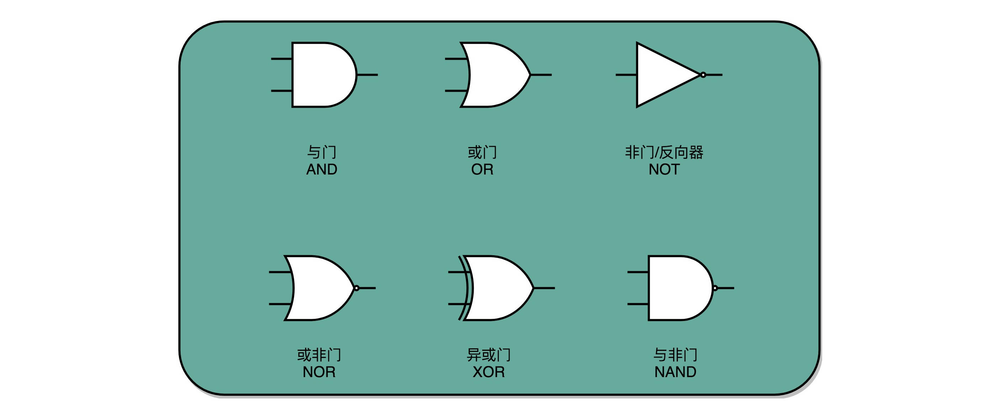
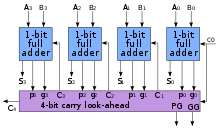

# 计算机组成原理

## 计算机结构

冯诺伊曼体系结构，也叫做存储程序计算机，存储程序其实包含了两个概念，可编程和可存储，如果计算机可编程不可存储，那么编写好的程序就不能存储起来下一次使用，如果计算机可存储不可编程，例如计算器只能进行加减乘除而做不了其他任何事，总之，不可编程和不可存储都大大降低了计算机的效率，这也就是存储程序计算机的由来

冯诺伊曼体系结构中，运算器(包括算数逻辑单元(ALU)和处理器寄存器)负责算数和逻辑运算，控制器(包括指令寄存器和程序计数器)负责控制程序流程，存储器(包括内存和硬盘等外存)负责存储数据和指令，输入和输出设备

现代所有计算机都是基于冯诺伊曼体系结构设计开发的，因此也就是计算机中任何一个部件都可以归到运算器，控制器，存储器，输入和输出设备中，而所有的程序都可以抽象为从输入设备读取输入信息，通过运算器和控制器执行存储在存储器中的程序，最后将结果输出输出设备中


图灵机，其基本思想就是用机器模拟人通过纸笔进行数学运算的过程，图灵机被认为是能够模拟所有人类可计算的计算过程，因此如果图灵机被实现那么就可以解决任何可计算的问题，也就是图灵完备(常说的某个编程语言是否图灵完备即是指该语言能否模拟出图灵机，图灵不完备的语言常见原因比如无限循环或递归受限(不支持`while(true)`)，这样也就是不能模拟无限长的纸带)

人通过纸笔进行数学计算分为两步，第一步在指纸上写上或擦除某个符号，第二步从纸上的一个位置移到另一个位置(在每个阶段人决定下一个动作依赖于人当前关注的符号和当前的思维状态，对应图灵机中的规则表)。图灵机模拟了这一过程，该机器有以下几个部分组成：
- 一个无限长的纸带，纸带被分为无数个连续的小格子，每个小格子上包含一个来自有限字母表的符号
- 一个读写头HEAD，其能够在纸带上左右移动并改变当前格子上的符号
- 一个状态寄存器，用于保存图灵机当前所处的状态，图灵机所有可能的状态数目是有限的
- 一套控制规则表，根据当前机器所处的状态以及当前读写头所指的格子上的符号来确定下一步的动作(修改当前符号/向左或向右移动读写头/修改状态寄存器)

冯诺伊曼体系结构侧重于硬件抽象，而图灵机侧重于计算抽象

## 衡量CPU性能

CPU的主频，比如2.8GHz指的就是在1秒内可以执行的简单指令数量为2.8G条，更准确的说这2.8GHz代表CPU中的时钟能够识别出来的最小的时间间隔，CPU中的时钟就是晶体振荡器(Oscillator Crystal)，晶振每“滴答”一下就是一个时钟周期

time命令可以统计该程序实际在CPU上所花的时间，time命令会返回三个值：
- real time：运行程序整个过程中消耗的时间，包括了CPU切换去执行比的程序或等待IO操作等
- user time：CPU在运行该程序，在用户态运行指令的时间
- sys time：CPU在运行该程序，在内核态运行指令的时间
所以，程序实际花费的CPU执行时间 = user time + sys time。注：在多核CPU中可能user time + sys time > real time，因为程序中指令可能被分配在多核上并行执行

程序的CPU执行时间 = CPU时钟周期数 * 时钟周期时间 = 指令数 * 每条指令的平均时钟周期数(Cycles Per Instruction，CPI) * 时钟周期时间
因此要解决性能问题就可以从三个方面入手：
- 指令数：代表执行该程序需要多少条指令，用哪些指令，这个很多时候都是交给编译器，编译器负责编译成最优的机器指令
- 每条指令的平均时钟周期数CPI：代表一条指令需要多少个CPU时钟周期，现代CPU通过流水线(pipline)技术让一条指令所需的CPU时钟周期尽可能少
- 时钟周期时间：就是CPU主频，这个取决于硬件

## 指令和运算

CPU指令可以分为五类：
- 算术类指令：加减乘除
- 数据传输类指令：变量赋值，向内存中写入数据
- 逻辑类指令：逻辑上的与或非
- 条件分支类指令：if/else/switch
- 无条件跳转指令：函数调用就是发起一个无条件跳转指令

CPU中有很多功能不同的寄存器：
- PC寄存器(Program Counter Register)：指令地址寄存器，用于存放下一条需要执行的计算机指令的内存地址(注：PC寄存器是个抽象的概念，IP指令寄存器和CS代码段寄存器是CPU中集体用来实现的寄存器)
- 指令寄存器(Instruction Register)：存放当前正在执行的指令
- 条件码寄存器(Status Register)：一个标记位(1/0)存放CPU进行算术运算和逻辑运算的结果，比如零标志(ZF)，进位标志(CF)，符号标志(SF)，溢出标志(OF)
- 除了上述这些特殊的寄存器外，还有很多用来存储数据和内存地址的寄存器，比如整数寄存器，浮点数寄存器，地址寄存器，还有些寄存器既能存放数据又能存放地址，称之为通用寄存器

CPU从PC寄存器中取出地址，找到地址内存中的指令，交给指令寄存器中执行，然后将PC寄存器中指令地址递增，重复操作，如果遇到跳转指令，就会修改PC寄存器中的地址从而下一条指令地址不再是连续的而是跳转到指定位置

`if (i == 0) { print("0"); } else { print("1"); }`其中`a == 0`被编译成了cmp和jne两条指令，首先通过cmp对i变量和值0进行比较，将结果存放到零标志条件码寄存器中，如果是true就置为1反之为0，接着jne(jump if not equal)指令查看零标志条件码寄存器值，如果为0(代表上一步比较结果为false)就进行跳转到后面跟着的操作数位置(即PC寄存器不再是递增而是设置为操作数地址)，操作数的位置在汇编中就代表这汇编文件的行号，在CPU运行是会代替为具体的内存地址。通过判断加跳转的操作就能实现if/else的逻辑

```txt
    if (i == 0) 
3b:                                           cmp [rbp-0x4],0x0
3f:                                           jne 4a
    {
        print("0");
48:                                           jmp 51
    } 
    else 
    {
4a:
        print("1");
51:
    }
```

`for (int i = 0; i < 10; i++) { print("hello); }`被编译成汇编后，当进入for代码段后就会进行一个jmp指令跳转，跳转到for代码段的最后，for代码段的最后汇编会添加上cmp和jle指令，首先cmp指令负责进行`i < 10`的判断，接着jle会判断上一步cmp的结果，如果说明还需要进行循环即跳转到jle指令后的行号处，该行号即代表着for循环中真正的逻辑代码，否则就继续向下执行即跳出了循环。相较于if/else，for循环中的跳转会跳转到所在行号之前的行号，从而达到循环的操作，而if/else只需要向后面的行号进行跳转即可

```txt
    for (int i = 0; i < 10;i ++) 
    {       
12:                                            jmp 1e
17:     
        print("hello");
1e:                                            cmp [rbp-0x8],0x10
22:                                            jle 17
    }
```

`add(a, b)`main函数中调用add函数被编译成汇编后，call指令会把当前PC寄存器中下一条指令的地址压栈(调用push eip)，从而当add函数调用完成后能够恢复main函数中要继续执行的指令地址，接着跳转到call指令后跟着的行号，即add函数处，在执行add函数中执行具体逻辑前，首先将rbp压栈(push rbp)，然后将rsp中的地址赋给rbp(mov rbp,rsp)(rbp和rsp本来指向的是main函数的栈帧，进入add函数就固然需要指向add函数的栈帧，因为add函数还没开始执行逻辑代码，因此此时rbp和rsp是指向同一个内存地址的，因为此时栈帧内还没数据)，接着执行add函数的逻辑，在执行完后退出add函数前会通过pop rbp将add函数的栈帧弹出系统栈，接着ret指令会自动弹栈(pop eip)，即将main函数需要恢复执行的指令地址赋给PC寄存器完成整个add函数的调用并继续执行main函数

为什么需要用到栈？对于main函数调用add函数来说，其实最重要的是add函数执行完后如何知道从main函数中的哪开始继续执行，可以使用寄存器来保存main函数执行到的位置从而让add函数执行完后明白从哪继续执行，但是函数调用是会嵌套的，即add函数中可能还会调用别的函数，而寄存器又是有限的，那么就要借助到栈这种数据结构，每个函数所占的栈中的内存空间称为栈帧(Stack Frame)，此外函数间大量的参数传递和复杂的数据结构也是通过压栈的方式进行传递的，总之，栈其实就是解决了寄存器个数有限从而无法实现复杂功能的问题

内存中栈的布局是固定的，栈的底在高地址处，而顶则是在低地址处，所以一次次的压栈，栈顶的内存地址从高地址向低地址移动，可以说内存中的栈是个倒放的栈容器，所以说的压栈操作其实在真是内存中更像是在栈顶附加新的数据

push指令：将一个寄存器中的数据压栈
pop指令：出栈用一个寄存器接受数据

rsp寄存器：栈指针寄存器，其中的指针永远指向系统栈最顶端的一个栈帧的栈顶
rbp寄存器：基址指针寄存器，其中的指针永远指向系统栈最顶端的一个栈帧的栈底

```txt
    0000000000000000 <add>:
    int static add() 
    {
0:                                             push rbp
1:                                             mov rbp,rsp
        return a + b;
12:                                            pop rbp
13:                                            ret
    }
    0000000000000014 <main>:
    int main() 
    {
14:                                            push rbp
15:                                            mov rbp,rsp
        int a = 10;
        int b = 20;
34:                                            call 0 <add>    
        int c = add(a, b);
42:                                            ret
    }
```

因为函数调用依赖于栈，而内存中的栈的大小又是有限的，那么当函数调用层次过深时(比如无限递归)就会导致栈溢出(stack overflow)

通过函数内联优化(Inline)：在编译时直接将函数具体代码插入到调用的位置来替换对应的函数调用，比如调用add函数直接修改为a + b，从而使得CPU需要执行的指令数变少了，也无需根据地址跳转到调用的函数处，压栈和出栈也不再需要，但是如果这个函数是个通用函数，被多处调用，那么内联就会导致程序大小膨胀

## ELF和链接

```txt
// add.c
    int add(int a, int b) 
    {
0:                                         push rbp
1:                                         mov rbp,rsp
        return a + b;
12:                                        pop rbp
13:                                        ret    
    }
```

```txt
// main.c
    int main() 
    {
0:                                         push rbp
1:                                         mov rbp,rsp
        int c = add(1, 2);                 
25:                                        call 2a <main+0x2a>
2a:                                                        
        return 0;
12:                                        pop rbp
13:                                        ret    
    }
```

add.c和main.c文件经过编译器和汇编器后(`gcc -c`)会分别生成目标代码(add.o和main.o)，但此时main.o是无法运行的，因为main.o中是无法知道处在add.c文件中的add函数的内存地址，所以目标代码中call指令跟着的是下一行行号，并且add.o和main.o所在的行号是相同的，也就是汇编代码中存在重复的内存地址。此时就需要通过链接器将目标文件链接后得到一个可执行文件

### ELF

在Linux下可执行文件和目标文件使用的都是一种ELF(Execuatable and Linkable File Format)的文件格式，称作可执行与可链接文件格式，其中不但存放了编译成的汇编指令，还包括一些其他数据

- file header：文件头，用来表示这个文件的基本属性，比如是否可执行，对应的CPU，操作系统等
- .text：代码段，用来保存程序的代码和指令
- .data：数据段，用来保存程序中已初始化的全局和静态变量
- .rel.text：重定位表，用来保存当前文件中哪些跳转地址是还不知道的，比如main.o文件中的main函数调用的add函数，在链接前是不知道需要跳转到的内存地址的
- .symtab：符号表，保存了当前文件中定义的函数和变量对应的地址

在Windows下和ELF功能相同的文件格式叫做PE(Portable Executable Format)，因为Linux下装载器只能解析ELF格式而不能解析PE格式，因此Windows下的可执行文件到了Linux下无法执行了

### 静态链接(Static Link)

静态链接会将所有目标文件合并成一个ELF文件，将各个目标文件的`.text`，`.data`等段进行合并，并生成全局符号表，然后根据全局符号表和各个目标文件中的重定位表调整合并后的汇编代码中的地址

```txt
// 链接成的可执行文件
    int add(int a, int b) 
    {
6b0:                                         push rbp
6b1:                                         mov rbp,rsp
        return a + b;
6c2:                                         pop rbp
6c3:                                         ret    
    }
00000000000006c4 <main>:
    int main() 
    {
6c4:                                         push rbp
6c5:                                         mov rbp,rsp
        int c = add(1, 2);                 
6e9:                                         call 6b0 <add>                                                       
        return 0;
70c:                                          pop rbp
70d:                                          ret    
    }
```

经过静态链接后，main.o和add.o被合并成了一个ELF文件，因为都在同一文件中，因此不再会出现重复的地址的问题，此外在main函数中调用add函数也不再是call下一条指令的行号了，而是替换为了add函数入口地址

在Windows下.lib文件和Linux下.a文件都是静态链接库

### 动态链接(Dynamic Link)

在动态链接的过程中要链接的不再是存储在硬盘上的目标文件代码，而是加载到内存中的共享库，所以动态链接是在运行时才能确定函数的跳转地址的。在Windows下.dll文件(Dynamic-Link Libary)和Linux下的.so文件(Shard Object)都是动态链接库

对于动态链接库来说有个很重要的一点就是它们必须是地址无关的，也就是动态链接库中的代码无论加载在哪个内存地址都能够正常执行，否则就是地址相关的，比如利用到绝对地址。为了实现地址无关，就需要使用相对地址，相对地址表示的是相对于当前指令偏移量的内存地址，因而只要动态链接库是放在一段连续的虚拟内存地址中就一定能够被正确调用执行

`gcc [file.c] -fPIC -shared -o [file.so]`将.c文件编译成.so动态链接库，其中-fPIC参数就是Position Independent Code的意思，即编译成地址无关代码

因为动态链接链接的是内存中的动态链接库，所以被链接的函数跳转地址是由运行时才能确定的，可以先假设动态链接在编译时将跳转地址设为一个无意义值(比如`call 0xffffffff`)，等到依赖的动态链接库加载到内存后将call后的跳转地址进行修改，但是这里就存在两个问题：
1. 现代操作系统不允许修改代码段(.text)，只能修改数据段(.data)
2. 如果不光调用的函数在动态链接库中，而函数自身也在动态链接库中(即一个动态链接库中的函数调用了另一个动态链接库中的函数)，如果通过修改跳转地址的方式也就是引入了绝对地址，导致代码不再是地址无关的，从而动态链接库就失效了

因此call指令的跳转地址只能回写到数据段中而不是通过回写代码段上的跳转地址，于是编译阶段链接器会为每个调用的动态链接库中的函数生成一段额外的代码段，通过这个额外的代码段的逻辑来从数据段获取到动态链接库中的函数地址从而完成调用，所以整个动态链接的逻辑总结来说需要一个存放动态链接库中的函数的真正地址的表GOT(Global Offset Table，全局偏移表)和一个存放额外生成的代码段的表PLT(Procedure Link Table，程序链接表)

```txt
可执行文件                   PLT表                      GOT表                 printf函数所在的动态链接库在内存中的地址          
main:                      printf@plt:                printf@got:           0xf7e835f0 <printf>:
    call printf@plt ---->      jmp *(printf@got) ---->     0xf7e835f0 ---->     // printf汇编代码
```

main函数中将调用printf函数编译为调用PLT表中的printf@plt函数，而printf@plt会跳转到GOT表中存放动态链接库printf函数在内存中的真正的地址，从而完成printf函数调用，整个只是个粗略的流程，接着来细看

PLT表中的逻辑会跳转到GOT表来找到真正的地址完成函数调用，因此也就是在调用PLT表中的逻辑(也就是额外生成的代码段)前就要求GOT表中必须初始化完所有的动态链接库中的函数的真正地址，这毫无疑问会大大增加进程启动时间，因此应该让GOT表中的数据延迟加载，当PLT函数第一次执行后再去初始化GOT表中对应函数的地址数据(延迟重定位)

```txt
void printf@plt 
{
address_good:
    jmp *(printf@got)   // 链接器在编译阶段会将printf@got的值填为下一条指令lookup_printf的地址(printf@got在GOT表中)
lookup_printf:
    // GOT表中负责查找printf函数所在的内存地址并填写到printf@got中
    goto address_good
}
```

在第一次调用printf@plt函数时，首先jmp跳转到GOT表中的printf@got处填写的地址处，因为链接器在编译期会将printf@got值填为printf@plt中jmp的下一条指令地址，即进入了lookup_printf处，这里会调用函数将GOT表中的printf@got值填为printf函数真正的物理地址，然后通过goto重新来到printf@plt开始处的jmp指令，此时跳转到printf@got填写的指针处也就是printf的真正地址了。在PLT表实现中，lookup_printf这段查找动态链接库中的函数真正地址的逻辑被抽离成common@plt作为公共入口，而不再是每个@plt项都单独有一份重复的指令，common@plt被放在PLT表头，即`plt[0]`

```txt
<common@plt>:
    pushl 0x80496f0
    jmp *(0x80496f4)   // 0x80496f4属于GOT表中的一项，对应的是_dl_runtime_resolve函数，负责完成函数地址重定位
<printf@plt>:
    jmp *(0x80496f8)   // 0x80496f8指的是GOT表中的printf@got
    push $0x00
    jmp common@plt
```

来看一下common@plt中的逻辑，首先pushl将地址压栈，也就是将最后调用动态链接库中的函数所需的参数压栈，然后jmp跳转，0x80496f4属于GOT表中的一项，进程还没运行时值是0x00000000，当程序运行起来后值被填充，这个值也就是_dl_runtime_resolve函数所在地址，该函数负责了查询动态链接库中的函数的真正地址并回填到GOT表中对应项上，因此所有动态链接库函数第一次调用时都是xxx@plt -> common@plt -> _dl_runtime_resolve函数的调用逻辑

因为common@plt逻辑是PLT表中所有函数共用的，那么_dl_runtime_resolve函数是如何知道要查询的是哪个动态链接库的函数并正确回填到GOT表中呢(此例中是printf)，答案就是在跳转到common@plt前所在的xxx@plt中的push指令，printf@plt中push $0x00，这个0x00对应的是printf函数在.rel.plt段中偏移量，_dl_runtime_resolve函数根据偏移量和.rel.plt段就能够定位到.rel.plt段中的具体项，这个项中包括了要解析的动态链接库的函数和offset字段，offset字段也就是对应的GOT表中项的地址，_dl_runtime_resolve根据offset就能回填重定位的真正地址

_dl_runtime_resolve函数是何时被写入到GOT表中的呢？在进程还未运行时值为0x00000000，当程序被装载但还没执行前，会先跳转到动态链接器(ld-linux-xxx)执行，其会负责将_dl_runtime_resolve地址写到GOT表中。GOT表中除了每个函数占用一个GOT表项外，GOT还保留的3个公共表项，也就是GOT表的前3项，在编译时后两项都置为0x00000000，直到启动后由动态链接器填充
- `got[0]`：本ELF的动态段(.dynamic段)的装载地址
- `got[1]`：本ELF的link_map数据结构描述符地址
- `got[2]`：_dl_runtime_resolve函数的地址

最后将PLT和GOT表进行抽象描述：

```txt
plt[0]:
    pushl got[1]
    jmp *got[2]
plt[n]:   // n >= 1
    jmp *got[n + 2]   // GOT前3项为公共项，第3项开始才是函数项，plt[1]对应的GOT[3]，依次类推
    push (n - 1) * 8
    jmp plt[0]

got[0] = .dynamic段地址
got[1] = link_map地址(编译时填充0x00000000)
got[2] = _dl_runtime_resolve函数地址(编译时填充0x00000000)
got[n + 2] = plt[n] + 6   // 编译时填充为plt[n]代码段的第二条指令，在函数第一次被调用后会被_dl_runtime_resolve函数填充为动态链接库函数的真正地址
```

第一次调用printf函数(进行动态重定位)：调用printf函数处编译为call printf@plt，进入printf@plt中jmp指令跳转到printf@got值中的地址处，因为在编译时被填充为printf@plt的第二条指令地址也就是jmp跳转到了printf@plt的下一条指令push(printf@got不是函数而是GOT表中的一项值)，push指令后jmp跳转到`plt[0]`即common@plt，其中jmp指令跳转到`got[2]`即_dl_runtime_resolve函数，该函数负责查找printf函数真正的地址，并回填到GOT表中printf@got项，然后完成printf函数的调用

第二次调用printf函数(已完成动态重定位)：调用printf函数处编译为call printf@plt，进入printf@plt中jmp指令跳转到printf@got值中的地址处，因为此时printf@got已经被_dl_runtime_resolve函数回填了printf真正的地址，于是jmp指令就是直接跳转到了printf函数所在的内存地址，直接完成函数调用

- [聊聊Linux动态链接中的PLT和GOT（１）——何谓PLT与GOT](https://blog.csdn.net/linyt/article/details/51635768)
- [聊聊Linux动态链接中的PLT和GOT（２）——延迟重定位](https://blog.csdn.net/linyt/article/details/51636753)
- [聊聊Linux动态链接中的PLT和GOT（３）——公共GOT表项](https://blog.csdn.net/linyt/article/details/51637832)
- [聊聊Linux动态链接中的PLT和GOT（4）—— 穿针引线](https://blog.csdn.net/linyt/article/details/51893258)

### 静态链接和动态链接的优缺点

- 静态链接生成的文件装载速度快，执行速度也比动态链接的快，因为不需要在运行是完成函数地址的重定位
- 静态链接生成的文件体积比动态链接生成的大，因为静态链接中直接填写了正确的函数调用地址，被依赖的函数文件必须被包含在静态链接生成的文件中，而动态链接则不需要
- 多个静态链接生成的文件可能包含相同的公共代码，不但文件大小膨胀，还会增加内存占用造成浪费，增加页面交换和调页的频率
- 动态链接不仅仅实现了代码共享，更重要的是模块化，动态链接库和可执行文件不耦合，只要定义的接口不变，那么动态链接库中函数具体逻辑的变化对可执行文件是无感的，而静态链接下一旦函数逻辑发生变化就必须将所有链接该库的文件全部重新编译
- 动态链接生成的文件是不是自完备的，必要要求依赖的动态链接库也存在，并且由于动态链接是在运行时才完成函数地址的重定位，因此如果依赖的动态链接库不存在或已不兼容，会导致程序运行错误

## 数字电路

电报：电报传输的信号有两种，一种是短促的点信号(dot信号)，一种是长一点的划信号(dash信号)，将点信号当作1，划信号当作0，于是电报信号就是一种二进制编码了。电报本质上就是一个蜂鸣器 + 长长的电线 + 按钮开关，按钮按下电路接通后蜂鸣器就会响，短促的按下就是个点信号，按的时间长些就是个划信号

当电线越来越长于是电阻就越来越大，于是只要电压不够即使按下按钮蜂鸣器也不会发声了，除了增大电压外，更有效的方法就是建立多个小型电路，信号可以在小型电路中正常传输，然后通过继电器(Relay)这个设备将信号从一个电路传递给下一个电路。继电器其实就是螺线线圈 + 磁性开关，当电路通电后螺线线圈产生磁力将另一个电路的磁性开关吸下来即打开了另一个电路，从而达到一个将信号传递给另一个电路的功能。而在生活中将信号传递给另一个组件也就是放大信号，这就是中继器(RP repeater)。中继器其实就是不断的通过新的电源重新放大已经开始衰减的原有信号，比如wifi信号放大器就是个wifi信号的中继器，再比如光缆用光信号传输，随着距离的增加也需要中继器来重新放大光信号。继电器不等于中继器，但它在电路中实现了中继器的功能


通过螺线线圈 + 磁性开关就可以很容易的创建出AND，OR，NOT这样的逻辑电路，比如假设上图中另一个电路的磁性开关默认是闭合的即电路默认是接通的，当下面的电路通电后螺线线圈产生的磁力将开关顶起也就是断开电路，这就是非门(NOT)，由此通过继电器的组合就可以创建出最基本的单元，也称为门电路。当然现代计算机可不是由无数个继电器组成的，但比如Havard Mark曾经的计算机就是由继电器组成的，虽然理论上可以用继电器造成现代的计算机，但在实际上不行，因为继电器是机械的，机械的开关耗时不短而且性能差，还容易发生机械故障(bug这词就是因为某个卡在Havard Mark的某个继电器上的bug)，后来出现了真空管，真空管最大好处就是能在百万分之一秒发生转变，但是其价格昂贵，耗电高，发热大，寿命短于是就被半导体实现的晶体管所代替了。总之，无论是真空管还是晶体管都是扮演着继电器的角色来实现基本的逻辑电路的功能。



门电路非常简单，但是后续的所有电路都是由这些门电路组成的，就像搭积木一样，即使现代包含十亿级别晶体管的CPU中也是由一个个门电路组成的

### 加法器

首先尝试实现一位的运算，`0 + 0 = 0, 0 + 1 = 1, 1 + 0 = 1, 1 + 1 = 10 = 0`可以看到一位的运算中A + B中和就是A异或(XOR)B的值，而进位就是A与(AND)B的值。通过异或门计算出个位，与门计算出进位，将两个门电路组合起来就是半加器(Half Adder)


半加器只能完成一位的运算，因为它只有两个输入加数A和被加数B，如果是多位运算就需要三个输入，加数A，被加数B和上一位计算的进位。可以通过两个半加器和一个或门组合成一个全加器(Full Adder)，首先加数A和被加数B通过半加器进行计算得到A+B的个位值和进位，再将A+B的个位值和输入的进位信号通过半加器计算得到A+B+进位信号的个位值和，最后将两个半加器计算出的进位信号通过或门最后的进位信号。通俗来讲就是做了两次加法，两次加法中只要有一次发生进位就说明要进位。


有了全加器如果要实现8位数的加法就很容易了，只要将8个全加器串联起来，最低位的进位信号为0，而其他位上的进位信号都由更低一位的全加器中的进位信号提供，如果要扩展到16位，32位，64位只要相应的串联相应数量的全加器即可。在整个电路设计中可以发现最高位上的全加器也输出了进位信号，但是因为存储的位数是固定的，那么最高位上的进位信号并不会反应在最后的计算结果上，但可以将它输出到其他标志位中从而让计算机知道这次加法运算的结果是否发生了溢出，也就是计算结果是否溢出其实是在硬件层面就提供了支持


上图中构建的8位加法器被称为行波进位加法器(Ripple-Carry Adder, RCA)，其有个最大的问题就是每一位的全加器的进位信号完全依赖于前一位的全加器的计算结果，即高位必须等待低位的运算结果从而造成这个加法器的延长时间(延长时间值的是逻辑门延时的叠加)很长，尤其是到了32位/64位的加法运算中。那么有没有办法让高位全加器的进位信号不再依赖于低位中的运算结果呢，表达式`C(n + 1) = (An AND Bn) + (An AND Cn) + (Bn AND Cn) = (An AND Bn) + (An AND Bn) AND Cn`的意思就是输入的三个信号中只要有两个及其以上的1就一定会进位，通过这个表达式对于任意一位加法器所需的进位信号其实可以通过An/Bn/An-1/Bn-1/...和C0来计算得到，而这些值都是计算前就确定的，因此不再依赖于前一位的计算结果，于是加法器中每一位的进位信号不再需要从前一个全加器中获得，而是通过统一的模块通过上述的表达式计算而得从而减少了延迟时间，这种加法器就被称为超前进位加法器(Carry-Lookahead Adder, CLA)



当然超前进位加法器中也存在问题，那就是通过表达式计算进位信号的的电路实现极其复杂，尤其是位数越高其表达式就越复杂实现的电路也就越复杂，因此当位数越来越多时通过超前进位加法器和行波进位加法器组合实现，比如64位的加法就通过4个16位的超前进位加法器分别计算各16位，然后串联成行波进位加法器完成4个16位计算结果的聚合

## 乘法器
