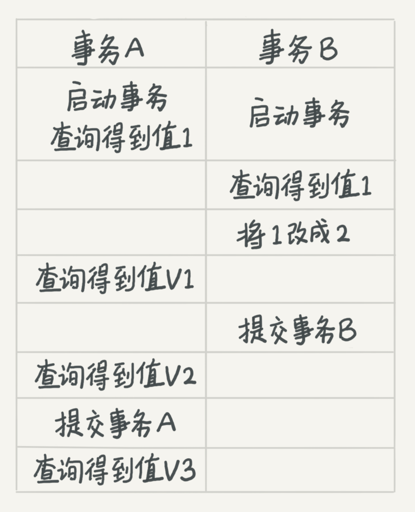

# MySQL基础

## SQL何执行流程

- Server层：包括连接器、查询缓存、分析器、优化器、执行器等，所有内置函数、存储过程、触发器、视图等也在该层
- 存储引擎层：负责数据存储和提起，其架构是插件式的，支持InnoDB、MyISAM、Memory等存储引擎

### 连接器

当建立连接时，连接器会到权限表中查出你拥有的所有权限，之后的该连接中的所有权限判断都依赖于刚刚读取到的权限，因此当更新权限后需要建立新的连接才能起效

建立连接的过程通常比较复杂，所以减少连接动作，尽量使用长连接(连接成功后，如果客户端持续有请求，则一直使用同一连接)

### 查询缓存

查询缓存指之前执行过的语句及其结果可能会以key-value对的形式，被直接缓存在内存中。key是查询的语句，value是查询的结果。如果你的查询能够直接在这个缓存中找到key，那么这个value就会被直接返回给客户端

**但大多数情况下不建议使用查询缓存**，因为查询缓存失效特别频繁，只要对表进行了更新，该表的所有查询缓存都会被删除，可能前面好不容易存下来的查询缓存还没用就被删除了，反而更浪费性能

在MySQL 8.0版本直接将查询缓存的整块功能删掉了

### 分析器

先做词法分析，例如`SELECT`等关键词，还有表名和列名

再做语法分析，判断输入的语句是否满足语法

### 优化器

在正式执行之前，MySQL会就索引的选择(当存在多个索引时)，表的连接顺序(多表做join时)等做出选择，从众多的选择中选择一个

### 执行器

在执行前要先判断一下对这张表是否有操作权限(由于某些触发器会在执行时才知晓具体的表，因此无法在优化器前做权限检查)

执行器就会根据表的引擎定义，去使用这个引擎提供的接口，例如调取InnoDB引擎接口获取这个表的第一行

## bin log和redo log日志模块

### redo log

redo log是InnoDB的，其记录了该行所在页做了什么改动，其作用是由于日志先被写入，使得写入磁盘的动作可以延迟(这就是MySQL中常说的WAL技术(Write-Ahead Logging))

InnoDB的redo log大小是固定的，循环写入。write pos是当前记录的位置，checkpoint是当前要擦除的位置，两者之间的空间是可用的，当write pos追上了checkpoint，就让checkpoint向后推进擦除一部分数据

有了redo log，InnoDB就可以保证即使数据库发生异常重启，之前提交的记录都不会丢失，这个能力称为crash-safe

### bin log

MySQL整体来看有两层，引擎层中InnoDB引擎负责管理redo log，而在Server层也有自己的日志，称为bin log(归档日志)

起初MySQL自带的引擎是MyISAM，但MyISAM是不具备crash-safe的能力的，bin log只提供归档功能，InnoDB发现只依靠bin log无法提供crash-safe功能，因此引入了redo log来实现crash-safe功能

### 两个日志模块差异

- redo log是InnoDB引擎特有的；bin log是MySQL的Server层实现的，所有引擎都可以使用
- redo log是物理日志，记录的是在某个数据页上做了什么修改；bin log是逻辑日志，记录的是这个语句的原始逻辑，比如给ID=2这一行的c字段加1
- redo log是循环写的，空间固定会用完；bin log是可以追加写入的。追加写是指bin log文件写到一定大小后会切换到下一个，并不会覆盖以前的日志

### 两个记录模块记录流程

首先来看一下update操作时bin log和redo log的记录流程，浅色表示在InnoDB中执行，深色表示在执行器中执行

可以发现在最后三步中将redo log拆分为了prepare和commit两个阶段，其实本质就是将redo log包装成事务，确保redo log和bin log同时写入，防止使用bin log恢复数据库的状态和现有数据库状态不一致

- 先写redo log后写bin log：redo log写入后即使数据库奔溃，数据也能正常恢复进数据库，但是当通过bin log恢复数据库时，由于bin log未被写入，因此恢复出来的数据库会比现有数据库状态少上那一条
- 先写bin log后写redo log：当通过bin log恢复数据库时，未被持久化到数据库的数据也会被恢复(redo log没写入，因此数据库没有这条数据)

## 浅讲事务隔离级别

- 读未提交：一个事务还没提交时，它做的变更就能被别的事务看到。 -- 脏读
- 读提交：一个事务提交之后，它做的变更才会被其他事务看到。  -- 不可重复读
- 可重复读：一个事务执行过程中看到的数据，总是跟这个事务在启动时看到的数据是一致的。当然在可重复读隔离级别下，未提交变更对其他事务也是不可见的。 -- 幻读
- 串行化：顾名思义是对于同一行记录，“写”会加“写锁”，“读”会加“读锁”。当出现读写锁冲突的时候，后访问的事务必须等前一个事务执行完成，才能继续执行。

依次分析四种隔离界比在以上流程中的值：
- 读未提交：则V1的值就是2。这时候事务B虽然还没有提交，但是结果已经被A看到了。因此，V2、V3也都是2。
- 读提交：则V1是1，V2的值是2。事务B的更新在提交后才能被A看到。所以， V3的值也是2。
- 可重复读：则V1、V2是1，V3是2。之所以V2还是1，遵循的就是这个要求：事务在执行期间看到的数据前后必须是一致的。
- 串行化：则在事务B执行“将1改成2”的时候，会被锁住。直到事务A提交后，事务B才可以继续执行。所以从A的角度看， V1、V2值是1，V3的值是2。

在MySQL中配置启动参数`transaction-isolation`来设定需要的隔离界别，默认是`Repeatable Read`

### 可重复读的实现

在MySQL中，实际上每条记录在更新的时候都会同时记录一条回滚操作。记录上的最新值，通过回滚操作，都可以得到前一个状态的值

因此在将一个值从1改到2、3、4，在MySQL中会记录如下的一个回滚日志

在前面说明了可重复读中每次启动事务都会新建一个视图，该事务中所有数据都是根据这张视图来的，这也就是俗称的多版本并发控制(MVCC)。
在将值修改的过程，其他事务运行时会对应不同的视图，比如这里的read-view A或者read-view B，其对应的值也不一样，当另一个事务获取read-View A中的值时，MySQL会通过回滚日志，将现在表里的4回滚到1，从而保证另一个事务在整个过程中获取到的都是同一个视图中的值

我们可以发现在一个事务中将会记录对数据库的任何操作的回滚日志，而这些回滚日志只有到这个事务提交后才会被删除(尤其在MySQL5.5之前，回滚日志会被保存到ibdata中，即使事务提交文件大小也不会改变)，因此如果使用长事务，MySQL就不得不保存大量的回滚日志，从而造成数据库奔溃，所以不推荐使用长事务

关于事务启动：
- 显示启动事务，使用`begin`或者`start transaction`，然后使用`commit`提交事务或者`rollback`回滚事务
- 当`set autocommit = 0`时会关闭自动提交，此时任意执行一条语句事务就启动了，并且不会被提交，直到显示使用`commit`或`rollback`
- 因此推荐`set autocommit = 1`打开自动提交

### 更多

- [可能更为详细的隔离级别笔记](../四种隔离级别.md)
