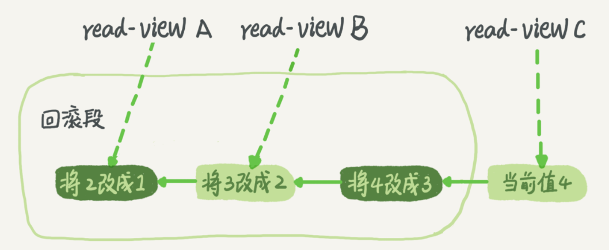

# MySQL基础

## SQL何执行流程

- Server层：包括连接器、查询缓存、分析器、优化器、执行器等，所有内置函数、存储过程、触发器、视图等也在该层
- 存储引擎层：负责数据存储和提起，其架构是插件式的，支持InnoDB、MyISAM、Memory等存储引擎

### 连接器

当建立连接时，连接器会到权限表中查出你拥有的所有权限，之后的该连接中的所有权限判断都依赖于刚刚读取到的权限，因此当更新权限后需要建立新的连接才能起效

建立连接的过程通常比较复杂，所以减少连接动作，尽量使用长连接(连接成功后，如果客户端持续有请求，则一直使用同一连接)

### 查询缓存

查询缓存指之前执行过的语句及其结果可能会以key-value对的形式，被直接缓存在内存中。key是查询的语句，value是查询的结果。如果你的查询能够直接在这个缓存中找到key，那么这个value就会被直接返回给客户端

**但大多数情况下不建议使用查询缓存**，因为查询缓存失效特别频繁，只要对表进行了更新，该表的所有查询缓存都会被删除，可能前面好不容易存下来的查询缓存还没用就被删除了，反而更浪费性能

在MySQL 8.0版本直接将查询缓存的整块功能删掉了

### 分析器

先做词法分析，例如`SELECT`等关键词，还有表名和列名

再做语法分析，判断输入的语句是否满足语法

### 优化器

在正式执行之前，MySQL会就索引的选择(当存在多个索引时)，表的连接顺序(多表做join时)等做出选择，从众多的选择中选择一个

### 执行器

在执行前要先判断一下对这张表是否有操作权限(由于某些触发器会在执行时才知晓具体的表，因此无法在优化器前做权限检查)

执行器就会根据表的引擎定义，去使用这个引擎提供的接口，例如调取InnoDB引擎接口获取这个表的第一行

## bin log和redo log日志模块

### redo log

redo log是InnoDB的，其记录了该行所在页做了什么改动，其作用是由于日志先被写入，使得写入磁盘的动作可以延迟(这就是MySQL中常说的WAL技术(Write-Ahead Logging))

InnoDB的redo log大小是固定的，循环写入。write pos是当前记录的位置，checkpoint是当前要擦除的位置，两者之间的空间是可用的，当write pos追上了checkpoint，就让checkpoint向后推进擦除一部分数据

有了redo log，InnoDB就可以保证即使数据库发生异常重启，之前提交的记录都不会丢失，这个能力称为crash-safe

### bin log

MySQL整体来看有两层，引擎层中InnoDB引擎负责管理redo log，而在Server层也有自己的日志，称为bin log(归档日志)

起初MySQL自带的引擎是MyISAM，但MyISAM是不具备crash-safe的能力的，bin log只提供归档功能，InnoDB发现只依靠bin log无法提供crash-safe功能，因此引入了redo log来实现crash-safe功能

### 两个日志模块差异

- redo log是InnoDB引擎特有的；bin log是MySQL的Server层实现的，所有引擎都可以使用
- redo log是物理日志，记录的是在某个数据页上做了什么修改；bin log是逻辑日志，记录的是这个语句的原始逻辑，比如给ID=2这一行的c字段加1
- redo log是循环写的，空间固定会用完；bin log是可以追加写入的。追加写是指bin log文件写到一定大小后会切换到下一个，并不会覆盖以前的日志

### 两个记录模块记录流程

首先来看一下update操作时bin log和redo log的记录流程，浅色表示在InnoDB中执行，深色表示在执行器中执行

可以发现在最后三步中将redo log拆分为了prepare和commit两个阶段，其实本质就是将redo log包装成事务，确保redo log和bin log同时写入，防止使用bin log恢复数据库的状态和现有数据库状态不一致

- 先写redo log后写bin log：redo log写入后即使数据库奔溃，数据也能正常恢复进数据库，但是当通过bin log恢复数据库时，由于bin log未被写入，因此恢复出来的数据库会比现有数据库状态少上那一条
- 先写bin log后写redo log：当通过bin log恢复数据库时，未被持久化到数据库的数据也会被恢复(redo log没写入，因此数据库没有这条数据)

## 浅讲事务隔离级别

- 读未提交：一个事务还没提交时，它做的变更就能被别的事务看到。 -- 脏读
- 读提交：一个事务提交之后，它做的变更才会被其他事务看到。  -- 不可重复读
- 可重复读：一个事务执行过程中看到的数据，总是跟这个事务在启动时看到的数据是一致的。当然在可重复读隔离级别下，未提交变更对其他事务也是不可见的。 -- 幻读
- 串行化：顾名思义是对于同一行记录，“写”会加“写锁”，“读”会加“读锁”。当出现读写锁冲突的时候，后访问的事务必须等前一个事务执行完成，才能继续执行。

依次分析四种隔离界比在以上流程中的值：
- 读未提交：则V1的值就是2。这时候事务B虽然还没有提交，但是结果已经被A看到了。因此，V2、V3也都是2。
- 读提交：则V1是1，V2的值是2。事务B的更新在提交后才能被A看到。所以， V3的值也是2。
- 可重复读：则V1、V2是1，V3是2。之所以V2还是1，遵循的就是这个要求：事务在执行期间看到的数据前后必须是一致的。
- 串行化：则在事务B执行“将1改成2”的时候，会被锁住。直到事务A提交后，事务B才可以继续执行。所以从A的角度看， V1、V2值是1，V3的值是2。

在MySQL中配置启动参数`transaction-isolation`来设定需要的隔离界别，默认是`Repeatable Read`

### 可重复读的实现

在MySQL中，实际上每条记录在更新的时候都会同时记录一条回滚操作。记录上的最新值，通过回滚操作，都可以得到前一个状态的值

因此在将一个值从1改到2、3、4，在MySQL中会记录如下的一个回滚日志

在前面说明了可重复读中每次启动事务都会新建一个视图，该事务中所有数据都是根据这张视图来的，这也就是俗称的多版本并发控制(MVCC)。
在将值修改的过程，其他事务运行时会对应不同的视图，比如这里的read-view A或者read-view B，其对应的值也不一样，当另一个事务获取read-View A中的值时，MySQL会通过回滚日志，将现在表里的4回滚到1，从而保证另一个事务在整个过程中获取到的都是同一个视图中的值

我们可以发现在一个事务中将会记录对数据库的任何操作的回滚日志，而这些回滚日志只有到这个事务提交后才会被删除(尤其在MySQL5.5之前，回滚日志会被保存到ibdata中，即使事务提交文件大小也不会改变)，因此如果使用长事务，MySQL就不得不保存大量的回滚日志，从而造成数据库奔溃，所以不推荐使用长事务

关于事务启动：
- 显示启动事务，使用`begin`或者`start transaction`，然后使用`commit`提交事务或者`rollback`回滚事务
- 当`set autocommit = 0`时会关闭自动提交，此时任意执行一条语句事务就启动了，并且不会被提交，直到显示使用`commit`或`rollback`
- 因此推荐`set autocommit = 1`打开自动提交

### 更多

- [可能更为详细的隔离级别笔记](../四种隔离级别.md)

## 浅讲索引

### 三个常见索引模型

- 哈希表：以key-value形式存储，通过哈希函数计算出key，当key重复时以链表形式向后追加
  - 优点：由于无需关心排序，因此插入很快，只需往后添加
  - 缺点：不具备范围索引，因此区间索引时要遍历整张表
  - 使用场景：适用于只有等值查询的场景
- 有序数组：按key顺序存储
  - 优点：key是有序排列的，通过二分查找法在等值查询和范围查询场景中的性能就都非常优秀
  - 缺点：当插入值时，需要将该key后的所有元素后移，耗费性能
  - 使用场景：适用于静态存储引擎，即数据存储后不再改变
- B+树：B+树比二叉树在每一层有更多的节点，从而使得从磁盘中读取数据块的次数减少，减少IO操作，加快查询速度
  - [B+树详解](../../data-structure/B树和索引.md)

在MySQL中，索引是在存储引擎层实现的，所以并没有统一的索引标准，即不同存储引擎的索引的工作方式并不一样

### 索引维护

在[B+树详解](../../data-structure/B树和索引.md)中可以知道在B+树中插入数据时，如果该页已经满了(即新插入的索引在两个现有索引之间)，那么就要申请一个新的页，并复制一般的数据，这个过程叫做页分裂，这毫无疑问会造成性能损失

怎么才能减少页分裂呢？如果我们的索引是递增的，那么数据的写入就都是追加，不会造成申请新的页的页分裂过程，并且InnoDB中辅助索引的B+树中记录的是主索引的值，因此主索引长度越小，辅助索引的B+树占用的空间也越小，总结就是**从性能和存储空间方面考量，自增主键往往是更合理的选择**

重建索引：
- 重建普通索引：索引可能因为删除，或者页分裂等原因，导致数据页有空洞，重建索引的过程会创建一个新的索引，把数据按顺序插入，这样页面的利用率最高，也就是索引更紧凑、更省空间
- 重建主索引：不论是删除主键还是创建主键，都会将整个表重建，消耗大

### 覆盖索引

如果查询条件使用的是普通索引(或是联合索引的最左原则字段)，查询结果是联合索引的字段或是主键，不用回表操作，直接返回结果，减少IO磁盘读写读取正行数据

例如一张表，自增id做为主键，身份证字段作为索引，此时如果需要通过身份证查询姓名的话，需要在辅助索引中先找到id，再在主索引中找到具体数据，经历了一次回表。但如果创建了(身份证，姓名)的联合索引时，只需要在辅助索引中找到该数据，它的索引中已包括了姓名，从而不需要了回表操作，减少性能浪费

数据量很大的时候，辅助索引比主键索引更快，这正是利用了覆盖索引的特效，否则还是需要回表操作

### 最左前缀原则

B+树这种结构中索引项是按照索引定义里面出现的字段顺序排序的，因此可以使用最左前缀原则来定位记录

在索引维护中举的例子中，创建的(身份证)的普通索引是可以通过最左前缀原则的(身份证，姓名)的普通索引实现的，此外`like`关键词查找身份证以某些数字开头的记录时，也可以通过最左前肢原则使用索引

考虑到最左前缀原则，因此在创建联合索引时字段的顺序也很重要：
- 将高频的单个索引可以作为联合索引的第一个字段，比如(身份证，姓名)索引就可以代替了(身份证)索引
- 当联合索引中多个字段都需要当作独立索引时，应将占用空间小的字段作为单独索引，减少空间

### 索引下推

在上个例子中(身份证，姓名)索引中，如果要查询`身份证 like '310%' and 姓名 = '张三'`，身份证这个字段可以使用最左前缀原则利用索引查询，但是在MySQL5.6之前，对姓名字段的判断就必须通过回表操作找到主索引中记录进行判断，但在MySQL5.6之后，可以在索引遍历过程中，对索引中包含的字段先做判断，直接过滤掉不满足条件的记录，减少回表次数，在这里姓名字段的判断也可以在普通索引中完成了，不再需要进行回表操作

## 浅讲锁

### 全局锁

在MySQL中使用Flush tables with read lock (FTWRL)添加全局锁，此时整个库处于只读状态的时候

**全局锁的典型使用场景是，做全库逻辑备份**，虽然FTWRL提供了全局锁，但是还是存在问题：
- 如果你在主库上备份，那么在备份期间都不能执行更新，业务基本上就得停摆
- 如果你在从库上备份，那么备份期间从库不能执行主库同步过来的binlog，会导致主从延迟

最关键的就问题就在于备份与数据更新无法同时进行，因此就需要一致性视图，这里就可以在可重复读隔离级别下开启一个事务。官方自带的逻辑备份工具是mysqldump。当mysqldump使用参数–single-transaction的时候，导数据之前就会启动一个事务，来确保拿到一致性视图。而由于MVCC的支持，这个过程中数据是可以正常更新的

虽然一致性视图解决了备份和数据更新无法同时进行的问题，但是这个隔离级别是由InnoDb这个引擎实现的，single-transaction方法只适用于支持事务的引擎，因此MyISAM就无能为力了，只能使用FTWRL了

为什么不使用set global readonly=true方式来开启全库只读
- 在有些系统中，readonly的值会被用来做其他逻辑，比如用来判断一个库是主库还是备库
- 如果执行FTWRL命令之后由于客户端发生异常断开，那么MySQL会自动释放这个全局锁，整个库回到可以正常更新的状态。而将整个库设置为readonly之后，如果客户端发生异常，则数据库就会一直保持readonly状态，这样会导致整个库长时间处于不可写状态

### 表锁

MySQL里面表级别的锁有两种：一种是表锁，一种是元数据锁（meta data lock，MDL)

#### 1. 表锁

使用`lock tables … read/write`创建表锁，其会在客户端断开连接后自动释放，也可以`unlock tables`主动释放

注意：这里的表锁除了会限制别的线程的读写外，也限定了本线程接下来的操作对象，比如对t1加锁，别的线程不能访问t1，而该线程也只能访问t1

在没有更细粒度的锁之前，表锁是最常用的处理并发的方法

#### 2. MDL

MDL是用来保证读写的正确性，防止一个线程查询数据时，另一个线程在改变数据结构，从而导致查询到的结果与数据结构不匹配

在MySQL 5.5版本中引入了MDL，MDL不需要显式使用，在访问一个表的时候会被自动加上。当对一个表做增删改查操作的时候，加MDL读锁；当要对表做结构变更操作的时候，加MDL写锁
- 读锁之间不互斥，因此你可以有多个线程同时对一张表增删改查
- 读写锁之间、写锁之间是互斥的，用来保证变更表结构操作的安全性。因此，如果有两个线程要同时给一个表加字段，其中一个要等另一个执行完才能开始执行

但要注意：当显示开启事务后，MDL锁直到被显示提交或回滚才会被释放，因此当这个事务中语句执行完成但未提交，这时其他线程修改数据结构尝试加写锁就会一直被阻塞，而同时后面的线程尝试加读锁也会因为前面的写锁被阻塞从而也被阻塞

### 行锁

MySQL行锁是由引擎实现的，InnoDB引擎支持行锁而MyISAM引擎就不支持行锁。不支持行锁意味着并发控制只能使用表锁，对于这种引擎的表，同一张表上任何时刻只能有一个更新在执行，这就会影响到业务并发度

#### 两阶段锁

在InnoDB事务中，行锁是在需要的时候才加上的，但并不是不需要了就立刻释放，而是要等到事务结束时才释放

例如一个事务中`update where id = 1`的语句已执行完成，但事务还未提交，此时另一个事务尝试`update where id = 1`的记录时由于前一个还未提交的事务还持有着`id = 1`的行锁，因此该事务被阻塞，因此如果你的事务中需要锁多个行，要把最可能造成锁冲突、最可能影响并发度的锁尽量往后放

### 死锁

当并发系统中不同线程出现循环资源依赖，涉及的线程都在等待别的线程释放资源时，就会导致这几个线程都进入无限等待的状态

#### 解决死锁

- 通过参数`innodb_lock_wait_timeout`根据实际业务场景来设置超时时间，InnoDB引擎默认值是50s
- 发起主动死锁检测，发现死锁后，主动回滚死锁链条中的某一个事务，让其他事务得以继续执行。将参数`innodb_deadlock_detect`设置为 on，表示开启这个逻辑（默认是开启状态）

#### 解决热点行更新

热点行更新指每个新来的线程都需要判断是否其会造成死锁，当多个线程同时对同一行做更新时会消耗大量CPU资源

- 如果你能确保这个业务一定不会出现死锁，可以临时把死锁检测关闭掉。一般不建议采用
- 控制并发度，对应相同行的更新，在进入引擎之前排队。这样在InnoDB内部就不会有大量的死锁检测工作了
- 将热更新的行数据拆分成逻辑上的多行来减少锁冲突，但是业务复杂度可能会大大提高

**InnoDB行级锁是通过锁索引记录实现的，如果更新的列没建索引是会锁住整个表的**
