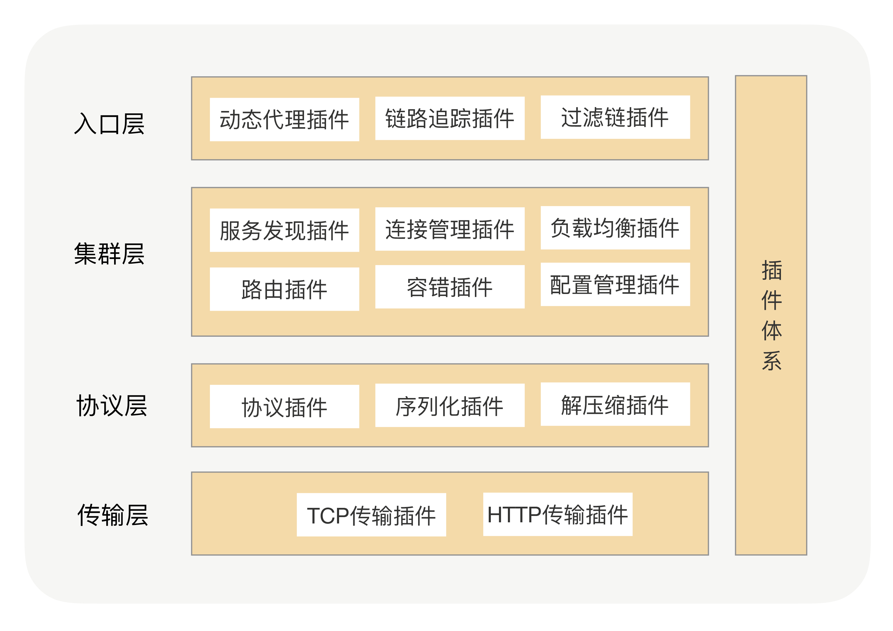
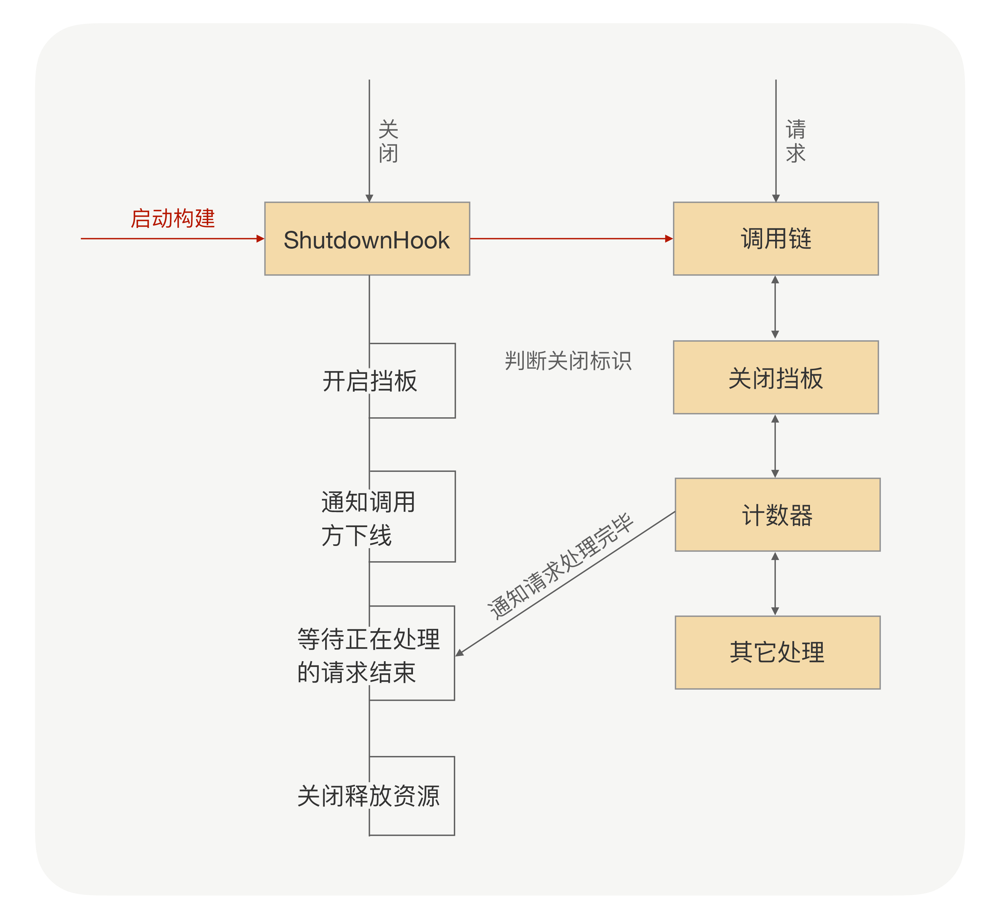

# RPC实战与核心原理

## rpc基础

如何设计一个协议：

- 魔术位：表明这是什么协议
- 整体长度
- 协议头长度：为了保证协议的可扩展性，协议头长度不能固定死
- 协议版本
- 消息ID：用于关联请求和对应的响应
- 序列换方式：报文payload采用的序列化方式
- 消息体

为什么rpc不直接使用http协议：

http协议无法实现请求和响应的关联，http协议本身是无状态的，http1.1虽然支持长连接，但服务端返回的多个请求很可能乱序抵达客户端的，此时如果客户端是同步阻塞等待着返回的那是没有问题的，但如果是异步的，那客户端就无法知道返回的响应对应的是哪个请求，因此rpc使用私有协议(rpc中通过在协议中带上一个消息id来保证请求和响应一一对应)

序列化方式：

- JDK原生: `ObjectOutputStream`和`ObjectInputStream`


- json: 进行序列化时占用较大的额外空间，json本身没有类型，像java强类型语言就必须通过反射解决
- hessian: 动态类型的(不需要手动指定类型)，二进制的，因此更加紧凑，生成的字节数更少，性能也更好
- protobuf: 需要定义IDL(Interface description language)，因为在IDL中定义了类型，所以序列化和反序列化速度很快，无需通过反射去获取类型，序列化后字节数很少

序列化协议权衡：性能，字节数(网络传输数据量)，通用性和兼容性(跨平台，跨语言，支持各种对象类型)，安全性(最为重要)

## rpc架构



### 服务发现

服务发现简要流程：服务提供方向注册中心上报节点信息 -> 服务调用方从注册中心拉取节点信息并缓存本地

为什么不通过dns实现服务发现：

因为为了提升性能和降低dns服务压力，dns采用多级缓存，一般配置的缓存时间较长，当某个服务节点下线或新服务节点扩容上线，其他服务是很难及时感知到的

即使设计成通过dns拿到负载均衡机器的ip，然后由负载均衡服务完成流量路由，也是不合适的，因为首先经过负载均衡就多了一次网络传输，此外负载均衡进行添加或移除节点一般都需要手动操作，会有延迟

为什么不直接使用zookeeper：

直接使用zookeeper本身没有什么问题，首先在zookeeper创建服务目录，然后服务提供者注册节点信息，再然后服务调用者订阅该服务目录并从zookeeper这获取到服务节点信息，并且当服务目录下节点信息发生变更后zookeeper会通知订阅的服务方

当zookeeper本身性能不佳，当连接到zookeeper节点数特别多，对zookeeper读写非常频繁，且存储的目录达到一定数量后，zookeeper会不再稳定，cpu飙升最终宕机

CAP: 一致性(Consistency)，可用性(Availability)，分区容错性(Partition tolerance)

zookeeper实现的服务发现是强一致的，zookeeper集群中任何节点数据发生更新都需要通知到其他zookeeper节点同步更新，以保证每个节点数据的强一致，但也造成了zookeeper性能下降

在服务发现中并不真正需要强一致(CP)，最终一致性(AP)是更好的选择，因为新服务刚上线没有流量立刻打过来也没啥问题，而服务下线rpc本身也会做重试，因此最终一致性更优

采用消息总线机制实现最终一致性
- 注册数据全量缓存在每个注册中心内存中，通过消息总线完成数据同步
- 当一个注册中心节点收到服务节点注册时，会生成一个消息推送给消息总线，每个消息都有个递增的版本号
- 消息总线会主动推送消息给每个注册中心，注册中心自己也可以定时去拉去消息，注册中心只接受版本号大于本地的版本号的消息，小于的直接丢弃，从而实现最终一致性
- 服务调用者可以从注册中心拿到指定服务的所有注册信息，并可以缓存在本地内存中
- 采用推拉模式，服务调用者可以及时从注册中心拿到服务注册信息的变化情况，并和内存中的缓冲数据合并

### 服务调用端流程

```txt
rpc调用流程：
调用端 -> 从注册中心获取所有注册节点信息和路由规则 -> 容错策略 -> 路由策略 -> 负载均衡 -> ...
```

### 健康监测

机器纬度 + 应用纬度

机器纬度：可以通过定时心跳请求来判断节点是否可用，心跳请求频率不宜过高，不然会给服务器造成压力，但也不宜过低，会导致不能及时发现问题机器，注意，心跳请求的节点不能和目标节点在同一物理机上，否则如果机器挂了，那么心跳也挂了，就无法感知到了

应用纬度：通过可用率判断该节点是否健康，可用率 = 某一时间段内 (成功次数 / 总次数)

### 路由策略

路由策略不适合放在注册中心，因为注册中心负责的是数据一致性，如果把大量复杂逻辑计算也放在注册中心后，当连接的节点数变多后就会导致注册中心压力很大

因此路由策略更适合放在服务调用端中计算，注册中心将路由规则下发给调用端，调用端在从注册中心这拿到所有注册节点信息后，根据规则(比如IP路由，参数路由：根据不同用户id)计算出可以请求的路由节点

因为路由本质上是节点分组(不同节点分到不同的set中)，流量隔离(泳道)，因此不论是打标签还是分流都天然适合在路由策略中做

此外，虽然路由策略是在调用方(上游)做的选择出服务提供方(下游)，这是符合rpc调用机制的，但不符合团队协作，比如下游服务希望修改路由策略或者新增路由策略，这就要求所有上游同时修改，并且必须先于下游服务先上线，一般来说是很难推动上游配合的，因为这对于上游不但没有收益还会面临风险，所以路由策略要么在初期就能够考虑周全，要么抽象成可配置的信息，动态下发

### 负载均衡

负载均衡也是在服务调用端这完成的，因为如果单独走一个负载均衡服务器的话，会存在如下问题：
- 搭建单独负载均衡服务器有额外成本
- 请求会多一次网络传输，浪费性能
- 负载均衡进行添加节点或摘除节点都需要手动操作
- 负载均衡是要可配置的，针对不同服务不同接口使用不同策略

rpc负载均衡策略一般包括：
- 随机权重
- 轮训权重
- hash：将一些请求固定打在一些节点上

自适应的负载均衡策略核心就是为每个节点进行打分(也就是权重)，打分的评断标准就是这个节点的处理能力：
- 运行时状态指标收集器：服务节点CPU核数，CPU负载，内存指标，这些通过调用端和服务端的心跳数据获取
- 请求耗时指标收集器：请求平均耗时，TP99，TP999等

服务调用端为每个节点打完分后，根据打分和每个节点配置的权重得出最终权重，再之后按负载均衡策略，比如随机权重/轮训权重等选出节点发起请求

路由策略一半是用于流量隔离，比如灰度验证，而负载均衡则是请求的智能调度，用于选择最合适的节点进行请求

### 容错机制(异常重试)

- 服务提供方的业务逻辑尽可能使幂等的，因为调用端因网络抖动导致超时后，很可能这个请求是成功到达服务端的，那么这个请求就会去执行业务逻辑，此时调用端重试后又发了次请求，等于执行了该业务逻辑两次，如果是插入这种不幂等的操作就会出现问题(可以在每个请求上带上唯一id来保证幂等)
- 重试时需要重置前一次时间，否则会导致重试次数累计时间用作超时时间(核心就是配置的超时时间是针对一次请求的，重试是另一次请求，不应该共用超时时间)
- 确保重试时负载均衡过滤到重试前调用失败的节点

### 优雅关闭

rpc服务本身迭代是非常快的，也就是频繁的部署，在部署过程中该节点是无法对外提供服务的，因此如何及时通知到调用方该节点已经下线了是非常重要的

通过注册中心通知：注册中心通知是异步的，存在延迟，因此部署中的节点很可能还在负载均衡的列表中，不可取
通过服务节点直接向调用节点通知：rpc中服务节点和调用节点间是长连接，当服务节点下线时就主动去通知所有调用节点，但如果这个主动通知的时间点非常接近真正关机的时间，就还是会造成请求失败，不可取

优雅关闭：当服务提供节点进入关闭流程时启动一个挡板程序，当此时该节点还收到请求后可以显示抛出ShutdownException给调用方，然后调用方就知道了该服务提供节点要下线了，调用方可以从负载均衡列表中去掉这个节点然后重试请求别的节点，当然，如果调用方一直没有请求服务节点，服务节点也可以主动通知调用方节点



关闭流程：由外到内
- 启动挡板程序，拒绝调用方的请求，返回显式异常告知调用方当前节点下线(挡板程序通过注册到Runtime.addShutdownHook中，该方法会捕获操作系统进程信号，并在进程关闭时调用注册的钩子)
- 服务提供节点主动通知所有调用节点
- 处理还在流程中的请求：每来一个请求都将引用计数器加一，处理完一个请求都将引用计数器减一，直到引用计数器减为0后才关闭释放资源

### 优雅启动

- 启动预热：jvm都有jit机制，可以将热点代码编译成机器码，因此当服务启动后可以先内部调用一些方法完成预热，并完成缓存等加载
- 延时暴露：在服务完全启动完后，才向注册中心注册自己，而不是rpc接口的这个bean创建的时候就向注册中心注册
- 新服务设置权重：向注册中心注册时可以带上自己的启动时间，然后调用方获取时拿到启动时间，根据启动时间计算出权重，启动时间越接近现在的权重越低，防止服务刚上线，还未预热完成就遭大量请求

启动预热和延时暴露都可以通过在服务中设立hook，让用户自行实现，然后再服务启动后调用hook完成预热和延时注册

### 服务保护

rpc服务的自我保护，即需要考虑到上游大量请求打来的情况，也要考虑下游严重超时的情况

限流(限流时要考虑应用级别和IP级别，针对性限流)：
- 单机配置限流：即给服务提供方的每个节点设置单独的限流阈值，配置方便，但当服务扩容时限流配置更新并不方便
- 注册中心或配置中心下发限流阈值：配置总限流阈值，下发时并下发总节点数，交给服务提供方的rpc框架自行计算限流阈值，服务扩容时方便更新限流阈值
- 调用端限流：在调用端的rpc框架中依赖一个单独的限流服务，每次发起请求时都主动请求限流服务，这样可以精确控制限流阈值，但多了次网络通信，损耗性能

限流方式：最简单的计数器，平滑限流的滑动窗口，漏斗算法以及令牌桶算法

熔断：

当服务端中某个接口调用的其他服务性能很差，一直超时，那么如果服务端这个接口被频繁调用，就会导致整个服务端积压大量请求而宕机，因此服务端就需要自我保护，即熔断

熔断工作机制：熔断器在关闭，打开和半打开三个状态间切换，正常情况下熔断器是关闭的，当调用下游服务出现异常后，熔断器会收集异常指标信息进行计算，当达到熔断条件后熔断器打开，只时再发起请求会直接被熔断器拦截，并返回失败逻辑，当熔断器打开一段时间后会转为半打开状态，这时熔断器会允许发起一个请求，如果这个请求能够正常得到服务端响应则状态置为关闭，反之状态仍为打开

在rpc框架中，发起请求前就先经过熔断器，如果熔断器状态为关闭则正常请求，如果为打开则直接执行熔断的失败策略

降级：

降级就是讲不怎么重要的业务逻辑降低优先级，先不处理，将资源竟可能让个优先级高，重要的业务逻辑先执行

- 压测：进行性能优化及容量规划
- 限流：防止服务端被流量高峰压垮
- 降级：优先保证核心服务高可用
- 熔断：防止当前服务被下游慢服务拖垮
- 自动扩缩容：可以扛住流量洪峰，需要资源冗余


