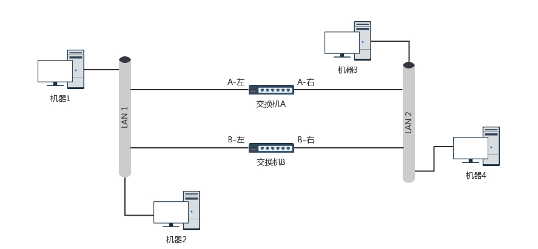

# 计算机网络

## IP

通过`ip addr`或`ifconfig`查看ip地址

IPV4只有32位不够用，因此有了现在的IPV6，有128位

分类不合理，本身紧张还被分成了5类，C类的私有ip范围只有254个不够用，而B类的私有ip范围有6w个，太多了

因为分类不合理，于是出现了CIDR(无类型域间选路)来设计地址，将IP地址一分为二，前者网络号，后者主机号

于是又有了广播地址和子网掩码的概念

IP分为共有IP和私有IP

192.168.0.x是最常用的私有IP地址，192.169.0是网络号，192.168.0.1通常是私有网络的出口ip，192.168.0.255是广播地址

MAC地址和IP地址：

一个网络包要从一个地方传到另一个地方，除了要有确定的地址，还需要有定位功能

举例来说MAC地址就像你的身份证号，身份证号是唯一的但是别人无法通过身份证号直接找到你，此时别人就可以根据ip地址来定位到你的位置，比如你在互金，别人就知道先坐地铁12号线，再坐地铁4号线(这个过程就相当于路由器路由，用的是IP地址)，当到了互金后，大喊你的身份证号码就能找到你了(这个过程相当于交换机转发，用的是MAC地址)

总结：MAC地址通信范围比较小，只能在一个子网里跨子网就必须用到IP地址

## DHCP

IP地址可以随意配置，但用户自行配置往往会出现问题。比如你想接入的机器都是192.168.1.x，但自己配置了个16.158.23.6的ip地址，即使你想ping的地址192.168.1.6就在你旁边，但是Linux系统可不会如你所愿直接发给旁边的192.168.1.6

在网络上的包必须是完整的，不能有上层没下层，意思就是有ip没用，还得有MAC地址才能把包发出去，因此Linux首先会去获取目标地址的MAC地址，但是当目标地址和本机地址是同一个网段，才会发送ARP请求来获取目标地址的MAC地址，很显然现在目的ip和本机ip不在一个网段，此时Linux认为这是一个跨网段调用，就会直接发给网关。如果配置了网关Linux就回去获取网关的MAC地址，然后将包发给网关，网关那能不能成功发送到192.168.1.6就得看网关上有没有做过配置了。如果没有配置网关，那么包压根发不出去。如果想把网关配成192.168.1.6，对不起，Linux不会让你配置成功的，因为网关至少和一个网卡在同一网段中的

DHCP(动态主机配置协议)就是帮助新接入的机器自动配置CIDR、子网掩码、广播地址和网关地址这些信息的

1. 新接入的机器会发送广播包(UDP封装的BOOTP)，其中带上自己的MAC地址请求个ip地址，这个称为DHCP Discover
2. 网络中的DHCP Server会感知到新接入的机器，此时会从地址池中分配一个未使用的ip地址给它给，并将子网掩码、网关和IP地址租用期等信息广播发送给新机器，这个称为DHCP Offer
3. 新机器此时可能会接收到多个DHCP Offer，一般会选取第一个到达的，并将MAC地址，接受的ip地址，提供该地址的DHCP服务器地址等信息通过广播的方式发送，主要为了告诉其他的DHCP服务器可以撤销提供给他的ip，这个称为DHCP Request
4. DHCP接收到新机器的DHCP Request后，会广播给新机器DHCP ACK包，表明已接受新机器的选择，并让网络中其他机器也感知到

DHCP还可以通过PXE(预启动执行环境)可以自动为新来的机器配置操作系统

## 交换机和集线器

当只有两台机器的时候可以通过网线直连，但当机器数大于两台时，就需要集线器或者交换机

集线器(Hub)是完全工作在物理层的，它将收到的所有字节全部复制到其他端口上，即广播模式

多路访问用于控制谁先发，谁后发，来防止混乱，主要有以下三种方式
- 信道划分：分成多个道，你走你的，我走我的
- 轮流协议：先你发，再我发，轮着来
- 随机接入协议：都直接发出去，遇到堵塞再退回来等空闲再发，以太网用的就是这个协议

交换机(Switch)是具有MAC地址记忆能力的，当第一次请求MAC地址的端口不知道时，它会先广播给所有端口，接着它会记录MAC地址和端口的映射关系，并带上一个过期时间，这个称作转发表

集线器是共享带宽，而交换机是独占带宽

当多台交换机连接起来时会存在环路问题，简单来说就是询问机器2的MAC地址的ARP请求到达交换机A的时，交换机A不清楚于是就广播给LAN2，接着交换机B纠结收到了交换机A在LAN2中广播，于是交换机B发现自己也不清楚，于是又转发给LAN1，接着交换机A又会接收到来自交换机B的广播，于是开始了周而复始的循环

计算机网络中使用STP协议来解决环路问题，其原理就是打破环构成的图，通过节点间的比较，选择一个为父一个为子来打破环，构成最小生成树

当机器和交换机越来越多，网络也越来越大，此时广播的性能毫无疑问会急剧下降，并且隐私性也无法保障，此时可以通过虚拟隔离(VLAN，虚拟局域网)来将机器隔离在不同的局域网中

此时需要将数据链路层的数据包的头上加一个TAG，里面有一个VLAN ID，这个VLAN ID共12位，因此最多只能划分4096个VLAN

如果交换机支持VLAN，那么就可以配置每个端口所属的VLAN，当数据包来时，交换机会识别出VLAN ID，并转发给相同VLAN的端口，即只有相同VLAN的包才会互相转发

对于支持VLAN的交换机有一种Trunk的接口，它可以转发任何VLAN的包，因此交换机之间可以通过这个接口连接

## ICMP

ICMP(Internet Control Message Protocol)：互联网控制报文协议，ICMP报文是封装在IP包里的

ICMP有很多不同类型，不同类型使用不同的代码，最常用的类型是主动请求为8，主动请求的应答为0

查询报文类型：

ping就是查询报文，ping的主动请求称为ICMP ECHO REQUEST，主动请求的回复称为ICMP ECHO REPLY

比起原生的ICMP其中多了两个字段，一个是标识符，另一个是序号

ping命令执行时会首先构建一个ICMP请求包，类型字段为8，序号(顺序号)在每发出一个请求包后加1，并会插入发送时间用于计算往返时间RTT，接着交给网络层和数据链路层构建数据包，最后发出数据包，如果没有接收到ICMP应答包，就说明目标地址不可达，如果接收到就表示可达

差错报文类型：

差错报文主要就是报告出现问题的原因，不同类型字段代表不同的错误状态，比如终点不可达为3，源抑制为4，超时为11，重定向为5

traceroute就是故意制造一些错误的场景，来获取差错报文以分析信息，比如traceroute会发送一份UDP数据包给目标地址，但目标端口设成超出范围的值，当目标主机生成返回一个端口不可达的ICMP差错报文，你就知道了数据包是送达的，如果差错报文是超时，那就说明数据包未达到目标地址(主要原因是UDP是无连接的，即收不到回复的)

## 网关

当Linux发现目标ip地址和本机ip地址不在同一网段时，就会发送给网关，网关往往是个路由器，但不一定是路由器，其本质是个处在网络层的转发设备，它会解给别的设备析MAC头和IP头，并决定转发

静态路由：

静态路由就是在路由器上自行配置一条条转发规则，比如目标网段192.169.3.x转发到3号口，其中具体分为转发网关和NAT网关

转发网关：不改变ip地址的网关，路由器只会在转发时修改目标MAC地址

NAT网关：改变ip地址的网关，目标地址不在同一局域网中但网段却相同，因此就要暴露一个公网ip供使用，路由器在转发公网ip到内网ip时不但会修改目标MAC地址，还会修改目标ip

NAT(Network Address Translation)：网络地址转换

除了根据目标ip配置路由外，还可以通过参数来配置路由，比如让指定源ip走指定网口转发

动态路由：

动态路由的核心就是如何在两个路由间找到最短路径，图中有两种方法Bellman-Ford算法和Dijkstra算法

距离矢量路由算法：

距离矢量路由算法是基于Bellman-Ford算法的，基本思想就是每个路由器中保存着一个路由表，其包含多行，每行包含两部分信息，一个是目标路由器，另一个就是到目标路由器的距离

每个路由器都是知道自己和邻居间的距离的，每过几秒，路由器就会将自己知道的目标路由器和距离告诉邻居，邻居路由器只需要将距离+1就能更新自己的路由表了

其存在两个问题：
1. 坏消息传的慢：比如A路由器记录到X路由器距离1，邻居B路由器记录到X路由器距离2，此时X路由器挂了，A路由器连不上X路由器了，但他发现它邻居B路由器到X路由器距离是2，因此他就更新自己到X路由器距离为3，接着C路由器也连不上X路由器了，但他发现邻居A路由器到X路由器距离为3，于是也更新了自己距离，往复循环，直到他们到X路由器的距离更新到了阈值，他们才正真明白X路由器原来挂了
2. 每次发送时都要发送自己整个路由表：当网络大了，这个路由表就会非常大，传输效率就会很低，因此小型网络(小于15跳)使用的路由协议RIP才会使用该算法

链路状态路由算法：

链路状态路由算法是基于基于Dijkstra算法的，基本思想就是路由器启动时会向say hello，得到邻居回复后就能计算出之间的距离了，接着将自己和邻居间的链路状态广播给整个网络，这样整个网络中的路由器都知道了这个关系，每个路由器都能够在本地构建一个完整的图，接着在这个图上使用Dijkstra算法找出两点间的最短路径

其只需要广播两两之间的关系而不用广播整个路由表，因此数据包很小，其次一旦有路由器挂了，邻居路由器就会广播这个消息，从而使得坏消息也能及时更新

动态路由协议：

OSPF：

OSPF(Open Shortest Path First)：开放式最短路径优先，其基于链路状态路由协议，由于主要用于数据中心中的协议，因此被称为IGP(Interior Gateway Protocol，内部网关协议)

OSPF能够发现图中存在的多个最短的路径，并在这些路径中进行负载均衡

BGP：

BGP(Border Gateway Protocol)：外网路由协议，其基于增强版的路径矢量路由协议，在外网中虽然存在更短的路径，但是这条路径不一定允许你使用

因此会将网络分为一个个自治系统AS(Autonomous System)
- Stub AS：对外只有一个连接，这类AS不会传输其他AS的包，比如个人或者小公司的网络
- Multihomed AS：可能有多个连接连到其他的AS，但是大多拒绝帮其他的AS传输包，比如一些大公司的网络
- Transit AS：有多个连接连到其他的AS，并且可以帮助其他的AS传输包，比如主干网

BGP分为两类，eBGP和iBGP，边界路由器(AS间相连的)使用eBGP广播路由，AS内部使用iBGP找到最短路径的边界路由器来到达外网

在BGP中相较于距离矢量路由算法除了下一跳距离外，还会带上AS路径，因此A是知道B是通过自己知道的X，因此当A连不上X后，不会再通过B来更新，解决坏消息传递慢的问题，其次整个网络中将AS看作整体，而不再关注AS中一个个具体的路由器，因此即使共享整个表问题也不大

## TCP/UDP

数据包是UDP还是TCP通过IP头中的8位协议判断

### UDP

UDP(User Datagram Protocol)：用户数据包协议，UDP是无连接的，不能保证可靠的交付数据，没有拥塞控制

UDP将应用层的数据直接加上UDP的首部信息发送出去，即面向报文传输的协议，UDP首部开销小，只有8个字节

因为UDP首部开销小，无连接等特性，其适用于三种场景：
- 对丢包不敏感的应用：DHCP
- 无需建立连接的广播应用：DHCP
- 需要处理速度快，时延低，容忍少量丢包，即使网络拥塞也要尽快送达：流媒体协议，实时游戏

### TCP

TCP(Transmission Control Protocol)：传输控制协，TCP提供一种面向连接的、可靠的字节流服务

所谓面向字节流就是指TCP会将用户的数据块进行合并或分拆，然后进行传输(IP包本身不是流，而是一个个数据包)

重要的是SYN置1表示该请求在请求连接，ACK置1表示此时请求中确认号是有效的，FIN置1表示该请求在释放连接

TCP首部20个字节，带上可选的最多60个字节

TCP的可靠传输是基于滑动窗口实现的，对于发送端来说存在滑动窗口分为四段：发送且确认的，发送但未确认的，未发送但可发送的(Advertised Window)和未发送且不可发送的

确认和重传机制：每个数据包发送后都必须收到个ACK包，当数据包发送后超过一定时间(就是超时时间，通过采样RTT平均时间和波动范围确定，称为自适应重传算法)，就会重传，且每次超时重传后都会将超时时间设为原先的两倍，因为屡次超时就说明网络拥塞，不宜频繁发送

超时触发重传存在超时周期过长问题，因此快重传机制(也是拥塞控制的机制)，一旦发现一个失序报文，就立刻发送三个冗余的ACK(序号为失序的前一个)，发送端接收到后就不等超时立刻重传

TCP流量控制：

流量控制的作用是让发送方感知到我这能接受的能力，就是不要发送的太快

流量控制是通过滑动窗口实现的，TCP首部里有窗口字段(Advertised Window)，可以用来告诉发送方我这里现在可容纳的窗口大小，当接收方告诉发送方窗口大小为0时，此时发送方会启用一个坚持定时器，来定时探测接收方的窗口大小，这是为了解决接收方传递可用的窗口大小时丢失造成死锁的情况

TCP拥塞控制：

流量控制考虑的是接收方，拥塞控制考虑的是整个网络，拥塞控制主要为了避免两种现象：包丢失和超时重传

慢启动算法：

拥塞窗口由小到大 1，2，4，8指数级扩大，当到达慢启动阈值时，启用拥塞避免算法

拥塞避免算法：

只要网络不拥塞就试探调大拥塞窗口(每次 + 1)，旦发现拥塞(即超时了)，那么就将慢启动阈值设为原来的一半，从1开始重新慢启动算法

快重传：

快重传要求接收方一旦发现一个失序报文，就立刻发送三个冗余的ACK(序号为失序的前一个)，发送端接收到后就不等超时立刻重传认，随后进入快恢复算法

快恢复：

在接收到3个以上的重复ACK后将慢启动阈值设为原来一半，并从一半的位置开始执行拥塞避免算法

BBR(Bottleneck Bandwidth and Round-trip propagation time)：

TCP拥塞控制的目标是最大化利用网络上链路的带宽，一条网络链路就像一条水管，水管中水越满就说明带宽用得越充分
水管内的水的数量 = 水管的容积 = 水管粗细 x 水管长度
网络内尚未被确认收到的数据包数量 = 网络链路上能容纳的数据包数量 = 链路带宽 x 往返延迟

上述的都是基于丢包的拥塞避免算法(不断增加发送窗口，直到发现开始丢包)，但是在实际中，丢包并不一定代表通道拥塞了，公网上存在着一定比例的丢包率，而上述的拥塞避免算法一旦发现丢包，就认定网络拥塞了，这毫无疑问是错误的选择。其次网络中会有一些buffer，上述的拥塞避免算法是通过灌水进水管的方式测试网络可接受的最大数据包量(不断增加发送窗口，直到发现开始丢包)，这毫无疑问会将buffer空间也计算进去，虽然看似网络中能接受的数据包量变多了，但buffer中的包是必须等待着被传输的，因此时延增长，此外如果连接较多时，可能会导致缓冲区被填满而丢包，这个问题被称为bufferbloat(缓冲区膨胀)

综上所述，BBR致力于解决两个问题：
1. 在有一定丢包率的网络链路上充分利用带宽
2. 降低网络链路上的buffer占用率，从而降低延迟

BRR解决策略：
1. 既然不容易区分拥塞丢包和错误丢包，BBR就干脆不考虑丢包
2. 既然灌满水管的方式容易造成缓冲区膨胀，BBR就分别估计带宽和延时，而不是直接估计水管的容积

但是带宽和延时是无法同时测准的，因为带宽最大时缓冲区会被占用，从而延时较大，当延时最小时，就要求缓冲区为空，那么带宽就较小，因此只能交替测量来得到带宽的最大值和延时的最小值

BBR流程：
1. 慢启动：指数级增加发包速率，直到将整个网络填满，包括缓冲区(而上述算法在有一个丢包时就会进行拥塞控制)，当有效带宽不再变化时就说明塞满了，于是进入拥塞避免
2. 排空阶段：指数级降低发包速率，直到延时不再降低时，就说明整个网络中buffer被排空了

慢启动的最后带宽用作计算，因为此时带宽值最大，慢启动的最开始延时用作计算，因为此时延时最小

TCP三次握手：

为什么需要第三次握手，事实上第二次握手的时候客户端已经处在连接建立的状态(第三次握手SYN不等于1了)，但是存在一种客户端第一次建立连接请求在网络中过了很久才到达服务端，客户端以为超时重传了，而重传的很快服务端就回应了，而后客户端第一次的请求到了服务端，服务端不知道这个请求已经被重传过了，因此也回应了，如果此时是两次握手建立连接，那么两个连接就会被建立，而其中一个是平白无故占用服务端资源的，因此第三次握手就是来解决这种情况

为什么不是四次握手，毫无疑问第三次客户端向服务端挥手后也是没法感知到服务端有没有收到的，因此第四次挥手是可以的，但是客户端怎么保证第四次挥手服务端一定收到了呢，那是不是就要第五次挥手了，从而就变成无止境的相互挥手了(究其原因是因为客户端和服务端之间永远没有办法确切感知到对方的存在)，因此第四次挥手是可以的，但四万次挥手都没法保证连接一定可靠，只要消息有来有回，就认定是成功建立连接了

TCP四次挥手：

在客户端进行最后一次挥手后会启动一个等待定时器，在等待2MSL(MSL为最长报文段寿命，通常为2分钟)，其作用是因为最后一次挥手后服务端是没有确认回复的，因此客户端需要确认服务器接收到了客户端的挥手，服务端在发起断开连接后在2MSL中如果没有收到确认，会重传，此时客户端处在等待2MSL中，因此就能回答。此外等待2MSL还能保证整个连接中的报文段都过期了，这样上一个连接中的迷失的报文段就不会影响到后一次的连接了

注：MSL(Maximum Segment Lifetime)和TTL(Time to Live)都和报文生存有关，只是前者是时间维度而后者是经过路由跳数，不是时间单位，而RTT(Round-Trip Time)是往返时延

出现大量time_wait原因：即你是主动释放连接的一方，也可以设置快速回收time_wait的连接或允许将time_wait的连接应用于新的TCP连接

出现大量close_wait原因：代码中建立的连接没去close

## Socket

{IP:Port} => 套接字 Socket

Socket在Linux中是以文件的形式存在的，还存在文件描述符，写和读都是通过文件描述符的

基于TCP的Socket编程：

通过bind函数指定ip和端口，ip用于指定监听机器上的网卡，端口用于让内核能将数据包发给应用程序
调用listen函数开始监听，此时客户端就可以发起连接了，叫作监听Socket
客户端通过connect函数发起连接，内核会分配一个临时端口给它建立连接，这是由监听Socket完成的
服务端通过accept函数会获得一个新的Socket连接，叫作已连接Socket，用于read/write

基于UDP的Socket编程：

通过bind函数指定ip和端口即可，无需listen和connect，因为UDP是无状态的，无需每对连接建立个新的Socket，每次通过sendto和recvfrom即可

处理大量Socket：

// TODO: 
1. 多进程/多线程
2. IO多路复用 select
3. IO多路复用 epoll

## HTTP

