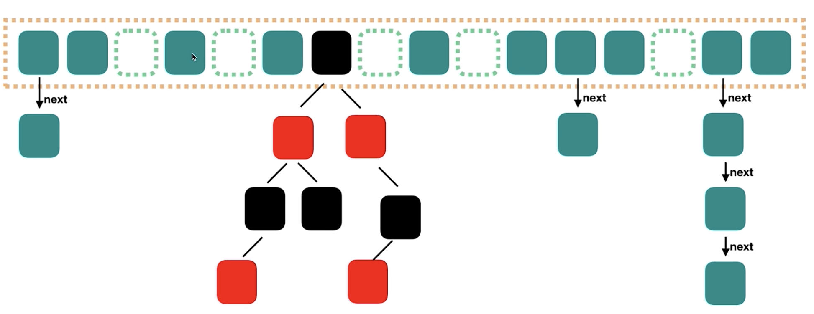

# 并发容器

## 古老的并发容器

`Vector`：线程安全的ArrayList，通过synchronzied锁住方法来保证线程安全
`Hashtable`：线程安全的HashMap，通过synchronzied锁住方法来保证线程安全

`Collections.synchronziedList`/`Collections.synchronziedMap`两个方法可以分别将list或map包装成线程安全的容器，具体实现就是在其中每个方法都通过synchronzied锁住同一个对象来保证线程安全

总结：这些方法都是通过synchronzied来实现线程安全，性能较差

## ConcurrentHashMap

HashMap存在的并发问题：
- 死循环导致CPU占用率100%：在put时多线程都造成rehash扩容操作，此时可能造成一个桶上形成环形链表，进而造成死循环(在JDK1.7中将节点hash到新数组中用的是头插法，因此当链表本来是A->B时，另一个线程先一步hash完后变成了B->A，此时A->B后又B->A，造成了死循环)
- 同时put碰撞导致数据丢失
- 同时put扩容导致数据丢失

### ConcurrentHashMap在JDK1.7中实现

ConcurrentHashMap使用了分段锁的思想：锁的时候不锁整个hash表，而是只锁一部分

ConcurrentHashMap中维护着一个Segment数组，每个Segment可以看做是一个HashMap

而Segment本身继承了ReentrantLock，它本身就是一个锁

在Segment中通过HashEntry数组来维护其内部的hash表，每个HashEntry就代表了map中的一个K-V，用HashEntry可以组成一个链表结构，通过next字段引用到其下一个元素(仍然是数组和链表组成的拉链法)

只要hash值足够分散，那么每次put的时候就会put到不同的segment中去。 而segment自己本身就是一个锁，put的时候，当前segment会将自己锁住，此时其他线程无法操作这个segment， 但不会影响到其他segment的操作

ConcurrentHashMap的rehash扩容只针对每个segment中的HashEntry数组进行扩容，而扩容时只要锁上自己的sefment即可保证线程的安全

### ConcurrentHashMap在JDK1.8中实现

ConcurrentHashMap使用了CAS + synchronzied方式来保证线程安全

put操作，当hash不冲突直接CAS操作设置值，否则synchronzied锁住冲突的hash处，然后进行链表或红黑树的添加操作

在JDK1.8中相较于以前的拉链法做了更新，当hash冲突后链表链接到8个后，会将链表转换为红黑树，由链表O(n)提升到红黑树O(logn)

注：为什么在8个元素后由链表转为红黑树，其一红黑树每个节点占用空间是链表两倍，其次真的发生8次hash冲突概率在1000万分之一(详见HashMap的注释)

此外要注意：并发容器提供的方法是原子的，但是原子方法 + 原子方法 != 原子方法的，如果此时应先尝试去容器中寻找自带的组合方法，比如replace，实在不行再用synchronzied加锁

## CopyOnWriteArrayList

线程安全的ArrayList，并且利用了读写分离的思想，其读不用加锁，只有写加锁，从而读读，读写都可以并行，只有写写不能并行

其中读操作(get)就是直接返回数组对应下标的值，写操作(add)则是先加锁，然后复制出来一份新的数组，在新的数组中写入新值，然后用这个新数组替换原先的数组

因此读操作往往可能读到的不是最新的数据，并且每次写都要复制一份数据，内存占用大，所以CopyOnWriteArrayList适用于读多写少，且读操作不要求一定要是实时数据的情况

注：在JDK1.8中写操作用ReentrantLock作为锁，而JDK11中直接使用了synchronzied，因为在不考虑中断，超时的情况下，synchronzied更有优势

关于在CopyOnWriteArrayList中的数组加上volatile关键词为什么还不能保证读取到最新数据，这是因为volatile修饰的仅仅是数组这个引用，而数组内的具体的值还是无法保证可见

## 并发队列

JDK中有两套实现，一是ConcurrentLinkedQueue为代表的非阻塞队列，另一是BlockingQueue接口为代表的阻塞队列

非阻塞队列(ConcurrentLinkedQueue)通过CAS方式在不加锁的情况下保证线程安全，因此性能比阻塞队列更好

阻塞队列(BlockingQueue接口)通过AQS实现，支持take和put操作，take操作在队列为空时获取元素的线程会被阻塞，put操作在队列满了时添加元素的线程会被阻塞

- `ArrayBlockingQueue` 有界的阻塞队列
- `LinkedBlockingQueue` 默认大小为无限的阻塞队列，也可以自定义大小
- `PriorityBlockingQueue` 相当于线程安全的优先队列，有界，但是会自动扩容
- `SynchronousQueue` 内部不存储任何元素，直接传递

阻塞队列在take和put的实现中会具体判断容量，为空或满了都会通过Condition的await方法来阻塞

## 总结

并发容器主要三种实现方法
1. CAS：ConcurrentHashMap
2. 单独复制一份进行写操作：CopyOnWriteArrayList 
3. AQS：阻塞队列BlockingQueue

