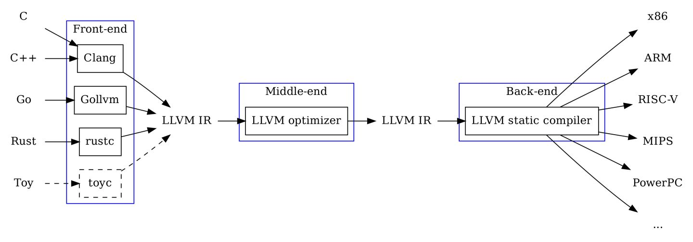
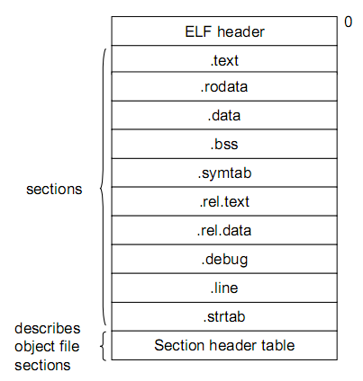

# 程序员的自我修养：链接，装载与库

## GCC编译过程

`gcc hello.c`编译命令可以简单分为四步：预处理(Prepressing)，编译(Compilation)，汇编(Assembly)和链接(Linking)

### 预处理

`gcc -E hello.c -o hello.i`，其中`-E`表示只进行预处理，不进行编译，汇编和链接

- 将所有的`#define`删除，并展开所有宏定义
- 处理所有条件预编译指令，如`#if, #ifdef, #elif, #else, #endif`
- 处理所有`#include`预编译指令，将其中包含的文件插入该预编译指令的位置，整个过程是递归进行的，即包含的文件中可能还包含着其他预编译指令文件
- 删除所有注释`//, /* */`
- 添加行号和文件标识，如`#2 "hello.c" 2`，以便于编译时编译器产生调试用的行号信息及用于编译时产生编译错误或警告时能够显示行号

经过预处理的.i文件中不包括任何宏定义，宏定义已经都被展开，且包含的文件也已经被插入到.i文件中

### 编译

`gcc -S hello.i -o hello.s`，其中`-S`表示只进行预处理和编译，不进行汇编和链接

编译就是将预处理后的.i文件进行一系列的词法分析，语法分析，语义分析即优化后生成相应的汇编代码

### 汇编

`gcc -c hello.s -o hello.o`，其中`-c`表示只进行预处理，编译和汇编，不进行链接

汇编过程即将汇编代码转化成机器可以执行的指令，每一个汇编语句几乎都对应一条机器指令，因此整个过程比较简单，只需要根据汇编指令和机器指令的对照表进行翻译即可

### 链接

为什么需要链接？早期指令是需要指定物理地址使用的，但代码会被修改因此物理地址也会发生变化，此时就会造成频繁的修改对应的物理地址，于是在汇编中有了符号(Symbol)这个概念，可以为一个地址/函数/一段代码设置一个符号，汇编器会最后将它们替换成真实的物理地址，从而避免了频繁修改。接着由于代码量越来越大，因此需要按照文件模块进行划分，那么如何将多个模块组合成一个单一的程序呢？(比如该模块调用了其他模块中的函数)这些模块拼接的过程就是链接(Linking)

## 编译器

编译器负责将高级语言翻译成机器语言的工具，从而在编程时无需关心在不同架构CPU上的实现，编写的程序也不再依赖于特定架构的机器

编译器主要可以分为6步骤：扫描，语法分析，语义分析，源代码优化，代码生成和目标代码优化

编译器可以分为三个部分：
- 前端(frontEnd)：负责词法和语法分析，将源代码转化为抽象代码树
- 优化器(Optimizer)：在前端的基础上，将抽象代码树转化为中间代码进行优化
- 后端(backEnd)：将已经被优化过的中间代码转化为针对各个架构的机器代码
其中clang是LLVM的前端，而gcc负责了包括前端后端的所有功能，因此gcc(GNU Compiler Collection)称作GNU编译器套件

词法分析(Scanner)：扫描器根据有限状态机(Finite State Machine)算法将源代码的字符串分割为一系列的记号(Token)。词法分析器有个现成的工具lex。其会按照用户描述的词法规则将输入的字符串分割为一个个Token，使得开发者无需为每个编译器实现不同的扫描器

语法分析(Grammar Parser)：将扫描器生成的Token进行语法分析，从而生成语法树(Syntax Tree)，语法树是棵以表达式(Expression)为节点的树，比如赋值表达式，加法表达式等。在构建树的过程中会确定运算优先级，并对比如括号不匹配，确实操作符等报告错误。语法分析器也有个现成的工具yacc，其会根据用户给定的语法规则对Token进行解析，从而构建出棵语法树

语义分析(Semantic Analyzer)：语法分析中只能判断该表达式是否语法正确，但却不能判断其语义是否有意义，比如指针 * 指针是没有意义的。语义分析器只能对静态语义进行分析，比如类型转换等，而动态语义比如整除0就只能在运行期间报错。经过语义分析，整棵语法树中节点会被标记上类型，并且如果存在隐式转换也会在语法树中添加新的转换节点

上面的词法分析，语法分析和语义分析都是前端所做的，接下来就需要进行优化，但是优化是很复杂的，如果直接在语法树上优化是比较困难的，因此优化器会将语法树转化为中间代码(Intermediate Code)，它是语法树的顺序表示，其实它已经非常接近目标代码了，但中间代码是和目标机器和运行环境无关的，比如不包括变量地址，寄存器等信息

上图中可以看到，clang，rustc等都对应着不同的高级语言的前端，它们会将高级语言转化为LLVM的中间代码IR(Intermediate Representation)，经过优化器优化后交给后端LLVM，后端会负责目标代码生成和优化，最后生成对应架构机器的二进制代码。此外因为有了IR这个中间代码，高级语言间的差异也消失了，它们可以转化为IR后进行相互链接

## 目标文件

目标文件就是源代码经过编译后但未进行链接的中间文件(win下的.obj，linux下的.o)，其和可执行文件的格式几乎相同的，所以广义上将目标文件和可执行文件看成一类文件(win下为PE-COFF，linux下为ELF)

此外，动态链接库(Dynamic Linking Library)(win下的.dll和linux下的.so)及静态链接库(Static Linking Library)(win下的.lib和linux下的.a)也都是按照同一类文件存储(win下为PE-COFF，linux下为ELF)

总结，linux下包括 可重定位文件(目标文件)(.o)，可执行文件，动态链接库(.so)和静态链接库(.a)都是ELF(Executable Linkable Format)文件

目标文件与可执行文件格式跟操作系统和编译器密切相关，因此不同操作系统的平台下会有不同的格式，但无论win下的PE-COFF和linux下的ELF都是源于同一种可执行文件格式COFF，COFF主要贡献就是在目标文件中可以拥有不同数量，不同类型的段

### ELF文件结构

ELF文件头部是ELF文件头(ELF Header)，紧接着是ELF文件的各个段，然后是描述ELF文件中包含的段信息的段表(Section Header Table)，最后是字符串表，符号表等(这些其实也是段)

#### 文件头

`readelf`命令来查看ELF文件头(ELF Header)，文件头中包括ELF魔数，文件机器字节长度，数据存储方式，ELF版本，运行平台，ABI版本，ELF重定位类型，硬件平台，硬件平台版本，入口地址，程序头入口和长度，段表的位置和长度及段的数量等

ELF的魔数(一些类型的文件前几个字节内容是固定的，即程序可以通过这几个字节来判断文件类型，这几个字节即魔数)是固定的16字节，最开始的4个字节所有ELF文件都是相同的，分别为`0x7F, 0x45, 0x4c, 0x46`，其中后三个字节为ELF三个字母的ASCII码，第五个字节标识是32位还是64位，第6个字节为字节序，标识是大端还是小端，第7个字节标识ELF版本，一般是1，剩余9个字节作为扩展标识

`e_type`表示ELF文件类型，`ET_REL`代表可重定位文件(.o文件)，`ET_EXEC`代表可执行文件，`ET_DYN`代表共享目标文件(.so文件)

#### 段和段表

段表(Section Header Table)用于保存ELF文件中各个段的基本属性信息，段表类似一个数组，其中每个元素/结构体都代表着一个段，又被称为段描述符(Section Descriptor)。段表在ELF文件中的位置由ELF文件头中`e_shoff`决定

段表中每个段结构信息主要包括：
- `sh_name`：段名(段名对于编译器和链接器是有意义的，但对于操作系统并没有实质意义，而是由段的类型和标识位决定的)
- `sh_type`：段的类型
- `sh_flags`：段的标识位
- `sh_offset`：该段在文件中的偏移量(该段存在于文件中该偏移量才有意义，像`.bss`段不会真实存在于ELF文件中，因此偏移量也无意义)
- `sh_size`：段的长度
- `sh_link`：段链接信息

ELF文件中主要的段：
- `.text`：保存源代码编译成的机器代码
- `.data`：保存已初始化的全局变量和局部静态变量
- `.rodata`：保存只读数据，如const修饰的变量和字符串常量。`.rodata`段不但可以在语义上支持const关键字，操作系统还可以在加载时将`.rodata`段属性设为只读，这样所有修改操作都是非法的
- `.bss`：保存未初始化的全局变量和局部静态变量。`.bss`段中无内容，只占段表中的一个段描述符，该段描述符的size属性记录未初始化的全局变量与局部静态变量的大小总和，而每个未初始化全局对象与静态对象的大小是存储在符号表的size属性中
- `.comment`：编译器版本等信息
- `.debug`：调试信息，进行单步调试，监视变量这些前提需要编译器提前将源代码与目标代码之间的关系(比如目标代码中的地址对应源代码中哪一行，函数变量类型等)保存的目标文件中
- `.dynamic`：动态链接信息
- `.strtab/.shstrtab`：ELF中用到很多字符串，比如变量名，段名等，因为这些字符串长度是不定的，因此将他们全部集中起来存放在一个表`.strtab`中(所有字符串首尾相连，用`\0`分隔)，接着在`.shstrtab`中存储该字符串与其在`.strtab`中的偏移量，于是在ELF中只需要个数字偏移量即可表示字符串(在整个ELF中，需要从该文件头中分析出段表和字符串表(由`e_shstrtab`确定)后，才能解析整个ELF文件)
- `.symtab`：符号表，表中每项对应一个符号
- `.rel.text/.rel.data`：重定位表，存储对于在链接过程中需要对目标文件中进行重定位的部分。`.rel.text`是对于`.text`的重定位，`.rel.data`是对于`.data`的重定位

为什么程序的指令和数据分开存放？首先数据区域对于进程来说是可读写的，而指令区域是只读的，分开存放后可以分别设置读写还是只读的权限。其次将指令和数据分开存放可以提高局部性，从而增加CPU的缓存命中率。最后也是最重要的原因，当同时运行着多个该程序的副本时，它们的指令都是一样的，因此内存中只需要保存一份该程序的指令，对于那些只读的数据也是可以只保存一份在内存的(每个进程副本的数据区域是不共享的)，通过共享的方式可以节省大量内存空间

`.bss`和`.data`的区别：`.data`段中存储的是初始化过的变量，因此需要存储初始化的值，但`.bss`段中存储的是未初始化过的变量，未初始化即代表着只需要在虚拟地址空间进行分配即可，而无需对空间进行值初始化，因此`.bss`段只需要记录需要分配空间的大小即可，从而无需真正占用文件大小来存储初始化值。当程序加载时会为`.bss`段中变量分配足够空间并全部清理(这也就是为什么未初始化的值为0的原因)

符号表(Symbol Table)：

符号表中每项包括：
- `st_name`：符号名，包含了在字符串白表中的下标
- `st_value`：符号值，如果该符号不是COMMON类型，则代表在该段中的偏移量，如果是COMMMON类型则代表该符号的对齐属性，如果是可执行文件则表示符号的虚拟地址
- `st_size`：符号大小，对于包含数据的符号为数据类型的大小
- `st_info`：符号类型和绑定信息
  - 符号类型：
    - `STT_NOTYPE`：未知类型符号
    - `STT_OBJECT`：表示符号是个数据对象，比如变量，数组
    - `STT_FUNC`：表示符号是个函数或其他可执行代码
    - `STT_SECTION`：表示符号是一个段
    - `STT_FILE`：表示符号为文件名
  - 绑定信息：
    - `STB_LOCAL`：局部符号，对于目标文件的外部不可见
    - `STB_GLOBAL`：全局符号，外部可见
    - `STB_WEAK`：弱引用(在链接时，如果没有找到符号定义就报错则是强引用，而弱引用则是尝试找到符号定义，即使找不到也不会报错)
- `st_shndx`：符号所在的段在段表中的下标，但也存在几个特殊值：
  - `SHN_ABS`：表示该符号表示一个绝对值，比如文件名符号就是
  - `SHN_COMMON`：表示该符号是个COMMON类型的符号
  - `SHN_UNDEF`：表示该符号未定义，这个符号在本目标文件中被使用但定义在其他目标文件中

## 静态链接

链接过程即将多个输入的目标文件加工合并成一个输出文件。每个输入的目标文件都有自己的`.text`，`.data`等段，在合并过程中会将类型相同的段进行合并。使用这种方法的链接器都采用两步链接(Two-pass Linking)的方法，即整个链接过程分为两步：
- 第一步：空间与地址分配，扫描所有输入目标文件并获取其中各个段的长度，属性等信息，将类型相同的段进行合并并建立新的映射关系的段表，并将输入目标文件中的所有符号统一收集放到个全局符号表中
- 第二步：符号解析和重定位，读取输入目标文件中段的信息，重定位信息，并进行符号解析和重定位，调整代码中的地址

使用`objdump -h [file]`来查看ELF文件中段的地址分配情况，其中VMA(Virtual Memory Address)为虚拟地址，LMA(Load Memory Address)为加载地址。在链接前目标文件中所有段的VMA都是0，因为虚拟内存空间还没有分配，所以默认都是0，在链接后的可执行文件中各个段都被分配了相应的虚拟地址(在Linux下ELF可执行文件默认从0x08048000开始分配)(因为是虚拟地址，操作系统会负责映射到不同的物理地址上，所以可以相同)

