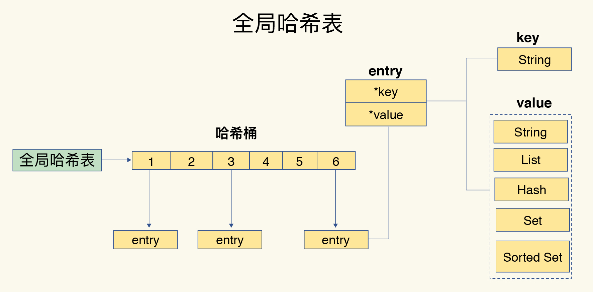

# Redis笔记

## 数据类型和底层数据结构

Redis使用全局哈希表来保存所有的键值对，全局哈希表中value保存的是(key, value)的键值对的指针

当key出现哈希冲突时，在全局哈希表中会通过链地址法(即哈希冲突的entry会以链表的形式保存)，那么此时当查询到哈希冲突的key时就需遍历整个链表才能找到所查找的entry，链表的遍历是O(n)，所以就非常耗时

此时Redis就会对全局哈希表做rehash动作，为了使rehash操作更高效，Redis默认使用两个全局哈希表并采用渐进式rehash。全局哈希表1和全局哈希表2，当一开始插入数据时都插入全局哈希表1，当需要rehash时：
1. 首先给哈希表2分配更大的空间(即增加桶的数量减少哈希冲突的情况)
2. 然后并不是直接把哈希表1中的数据全部拷贝到哈希表2(因为做全量拷贝时就会造成Redis线程阻塞而无法服务其他请求)，而是Redis仍正常处理客户端请求，每处理一个请求时将哈希表1中第一个索引(即桶)上的所有entry拷贝到哈希表2，然后等到处理下一个请求再将哈希表1中第二个索引上的所有entry全部拷贝到哈希表2，以此类推
3. 最后等到哈希表1中全部拷贝到了哈希表2后，释放哈希表1中空间

通过渐进式rehash，将一次性的大量拷贝的开销，分摊到多次处理过程中，保证了Redis的快速响应

- String：简单动态字符串
- List：双向列表 + 压缩列表
- Hash：哈希表 + 压缩列表
- Sorted Set：跳表 + 压缩列表
- Set：整数数组 + 压缩列表

压缩列表：其类似一个数组，但和数组不同的是，压缩列表在表头有三个字段zlbytes，zltail和zllen，分别表示列表长度，列表尾的偏移量和列表中entry个数，压缩列表中表尾还有个zlend，表示列表结束。压缩列表的优势在于如果要查找第一个元素和最后一个元素都是O(1)的，并且查询元素个数也是O(1)，但对于其他元素的查找就还是O(N)

跳表：其在链表的基础上，增加多级索引，通过索引位置的跳转实现数据的快速定位，整个查询过程就是在多级索引上跳来跳去，因此叫做跳表，跳表查找的时间复杂度为O(logN)

对于所有Redis的操作来说，对单个元素的操作基本都是O(1)，比如HGET，HSET，SADD，SREM等；对于范围操作，比如HGETALL，SMEMBERS等返回集合中所有数据的操作，是需要遍历整个集合的，复杂度一般都为O(N)，因此尽量避免；对于统计操作，比如LLEN，SCARD统计集合中元素个数的复杂度都是O(1)，Redis可以高效完成；此外比如对集合首尾元素的操作，因为压缩列表的支持，复杂度也只有O(1)

## 单线程

Redis的单线程主要是指Redis的网络IO和键值对读写是由一个线程完成的，这也是Redis对外提供键值存储服务的主要流程。但Redis的其他功能，比如持久化，异步删除，集群数据同步等，其实是由额外的线程执行的

单线程模式避免了多线程下共享资源的并发访问控制的问题

此外Redis使用到了IO多路复用的能力，由内核负责监听套接字上的连接请求和数据请求，一旦请求到了，就会通过回调的方法交给Redis线程处理，而不再会被阻塞在套接字上(比如阻塞在`recv()`上)

但单线程处理模式也存在个两个方面的问题：
1. Redis单线程中任意一个请求耗时(比如操作bigkey)会影响到后面的所有请求，进而影响整个Redis的性能。需要业务人员自行去规避
2. 并发量大时，单线程读写客户端数据存在性能瓶颈，虽然IO多路复用是非阻塞的，但单线程读写客户端数据是阻塞的。在Redis6.0中可以在高并发场景下通过多线程读写客户端数据，但真正键值对的读写还是由单线程完成

## AOF和RDB

Redis持久化主要有两大机制，AOF(Append Only File)日志和RDB快照

AOF是写后日志，意思是先将数据写入内存，然后再记录到日志，相较于MySQL中的WAL(Write Ahead Log)写前日志，在数据实质写入前先写入redo log以便故障时进行恢复

写后日志AOF中记录的是Redis收到的每一条命令，这些命令以文本的形式保存，AOF日志中`*n`表示当前命令有三个部分，每个部分都是以`$n`开头，表示该部分所占的字节数，而每个部分中具体的内容就是具体的命令、键、值，而写前日志redo log中保存的是对数据页的修改

写后日志AOF有两个好处：
- 因为写日志前已经执行过了命令，所以如果命令执行失败那么在日志中不会记录这个错误命令，而写前日志就会存在记录了错误命令的情况
- 其在命令执行后才记录日志，所以不会阻塞当前的写操作

AOF在写回磁盘时机存在两个问题：
- 当一个命令刚写入内存但还没来得及将日志写入磁盘时就宕机了，那么这个命令和相应的数据就有丢失的风险，因此这个命令无法通过日志进行恢复
- AOF虽然避免了对当前命令的阻塞，但如果写入磁盘的操作很慢，那么就会导致后续的写命令被阻塞无法执行

AOF三种写回策略：
- Always(同步回写)：每个命令执行完成后，立马将日志同步写回磁盘
- Everysec(每秒回写)：每个命令执行完后，只是先将日志写到AOF文件的内存缓冲区，然后每隔一秒把缓冲区中内容写回磁盘
- No(操作系统控制回写)：每个命令执行完后，只是先将日志写到AOF文件的内存缓冲区，然后由操作系统决定何时将缓冲区内容写回磁盘

随着AOF中记录的日志越来越多就会导致AOF文件越来越大，文件过大会造成三个问题：
- 文件系统对文件大小有限制，无法保存过大的文件
- 当文件过大时，再追加命令记录效率降低
- 当使用AOF进行故障恢复时，需要重新执行AOF中所有命令日志，如果日志文件过大就会导致恢复过程非常慢

AOF重写机制来解决这个问题，重写的核心在于整个AOF日志中针对同一个key会存在多个操作，而这些操作只需要将他们重写成一条命令即可，比如`set a 1`和`set a 2`最后重写成`set a 2`一条即可

AOF重写过程：一个拷贝，两处日志

每次执行重写时，主进程fork出后台线程bgrewriteaof子进程，fork会把主线程内存拷贝一份给bgrewriteaof子进程，其中就包括了数据库最新的数据，子进程就可以在不影响主进程的情况下逐一将内存中数据记入重写日志。因为主进程并未被阻塞，仍然可以处理新来的操作，如果有写操作主线程会写两份日志，包括本来的AOF日志和AOF重写日志，写本来的AOF日志作用是在重写过程中如果发生宕机，此时AOF日志还是齐全的，写AOF重写日志作用是当子线程重写完成后，将AOF重写日志应用到重写完的日志中即可保证此时该日志处在数据库最新的状态

父子进程重写潜在的阻塞风险：首先fork子进程这个瞬间是会阻塞主进程的，fork子进程需要拷贝进程必要的数据结构，比如拷贝页表(虚拟内存和物理内存的映射关系)等，但并不真正拷贝父进程拥有的内存中所有数据，fork采用操作系统提供的Copy On Write机制，避免了一次性拷贝大量数据给子进程造成长时间阻塞，也就是说虽然fork了子进程，但并没有申请和父进程相同的内存大小，此时父子进程指向的内存地址是相同的，只有当写操作发生时，才会拷贝出一份内存中真正数据提供给进程进行写操作。因此当AOF重写过程中，父进程还是有写操作命令进入，此时父进程就需要真正拷贝这个key所对应的内存数据，申请新的内存空间，内存分配是以页为单位进行的，默认是4k，因此当父进程操作的是个bigkey时就需要申请大块内存，产生阻塞，此外如果操作系统开启内存大页机制(Huge Page，默认页大小4k，大页内存页大小2M)，父进程即使操作的是个value和小的key，但因为内存分配是以页为单位，就必须至少分配2M，因此非常容易造成阻塞(Huge Page在Redis实际使用时建议关闭)

为什么重写时不复用原先的日志：因为父子进程同写一份日志必然会产生竞争问题，控制竞争就会影响父进程的性能，此外如果在重写过程中如果发送错误，复用原先的日志就会导致日志被污染，而重写一份新日志的情况下直接删除该文件即可

-----

RDB(Redis DataBase)文件记录的是某一时刻Redis内存中全量数据的快照，RDB快照相较于AOF日志，当宕机后恢复的很快，因为记录的就是内存中的数据，而AOF记录的是命令，必须将全部命令执行完后才能完成恢复

Redis提供两个命令来生成RDB文件：
- save：在主进程中执行，会导致阻塞，其他请求命令无法被执行
- bgsave：主进程fork一个子进程，专门负责写入RDB文件，避免了主进程的阻塞，是Redis RDB文件生成的默认配置

bgsave中，虽然fork出的子进程负责写入RDB文件，不会阻塞主进程，但主线程写操作并不能正常被处理，因为如果写操作更新的数据在更新前就被子进程写入RDB文件，那么这个写操作将会被丢失。Redis通过操作系统提供的Copy On Write写时复制技术(fork子进程时只会阻塞主进程申请内存空间并拷贝必要的进程数据结构，比如页表等，但主进程内存数据并不会被拷贝一份给子进程，而是读数据时共用，只有当写数据时才申请内存空间并对应的内存数据拷贝到新的内存地址上进行修改)，如果主进程只有读操作，那么bgsave子进程互不影响，当主进程有写操作时，这块数据将被拷贝一份到新的内存地址，主进程修改新的数据副本，然后bgsave子进程会把这个副本写入RDB文件，从而使得主进程可以正常执行并且数据保证不会丢失

RDB文件不易频繁生成快照，比如秒级生成，虽然bgsave不阻塞主线程，但：
- RDB文件每次都是内存数据全量写入磁盘，造成磁盘压力很大，当多个快照同时竞争磁盘带宽，更易导致性能下降
- fork子进程这个动作瞬间是需要阻塞主进程的，频繁bgsave也就是频繁fork，最终也就导致频繁阻塞主进程

因此更好的方案是快照+基于此快照的修改记录，也就是RDB+AOF，在Redis4.0中混合使用AOF和RDB快照，即快照不必频繁生成，通过AOF记录两个快照间的操作命令，并且当第二次快照生成时就可以清空AOF日志

RDB快照方案不适用于写操作非常频繁的场景，因为fork出bgsave子进程后，当主进程有写操作时需要先拷贝数据副本后进行修改，如果写操作非常频繁，那么在bgsave后台生成RDB文件过程中，就会频繁申请内存空间，导致内存很快被占用完，如果此时系统开启swap，那么Redis内存中数据就会被交换到磁盘上，性能骤降，如果没有开启swap，那么直接触发OOM，父子进程可能被操作系统直接kill掉

## 主从同步

Redis主从模式下，主从库间采用的是读写分离的方式，读操作主库和从库都可以接受，而写操作首先到主库被执行，然后主库将写操作同步给从库

### 主从第一次同步

启动多个Redis实例后，通过replicaof(Redis5.0之前为slaveof)命令形成主从关系`replicaof [master-ip] [master-port]`

1. 从->主：`psync ? -1`，psync命令表示从库要进行数据同步，该命令包括主库的runID(Redis实例启动后都会自动生成一个随机ID用于唯一标识这个实例)和复制进度offset两个参数，主库根据这两个参数启动复制，第一次复制复制时runID未知所以传`?`，offset传`-1`
2. 主->从：`FULLRESYNC [runID] [offset]`，主库收到psync命令后，用FULLRESYNC命令(FULLRESYNC表示第一次复制采用全量复制)带上主库的runID和主库目前的复制进度offset返回给从库，从库记录runID和offset
3. 主->从：主库执行bgsave，生成RDB文件，将RDB文件发给从库，从库接收到RDB文件后清空当前数据库后加载RDB文件。在主库将RDB文件从库过程中主库并不会被阻塞，此时主库收到的写命令并没有记录到RDB文件中，因此主库在内存中用专门的replication buffer记录RDB文件生成后的收到的所有写操作
4. 主->从：当主库完成RDB文件传输后，将此时replication buffer中记录的写操作发给从库，从库执行这写操作后就实现了主从同步

因为每个从库第一次主从同步都需要主库完成一次RDB文件的生成和传输，如果从库数量很多就会给主库带来压力，比如fork子进程时的阻塞，传输RDB文件占用的带宽等，此时可以通过主-从-从模式将主库生成和传输RDB文件压力分摊到从库上，即从库不在直接和主库进行交互，而是和另一个从库相互完成同步`replicaof [slave-ip] [slave-port]`

### 增量同步

当网络出现抖动时，从库重连主库如果每次也都进行全量同步开销就会很大，因此通过repl_backlog_buffer环形缓冲区实现增量同步

当主库的Redis实例只有有从库连接，主库就会将所有写命令缓存到repl_backlog_buffer中，repl_backlog_buffer 是一个环形缓冲区，主库会记录自己写到的位置(master_repl_offset)，从库则会记录自己已经读到的位置(slave_repl_offset)

当刚开始时主库和从库读写位置是相同的，随着主库不断接受写命令，master_repl_offset也就不断增加(offset单调递增)，从库在接收到主库发送的写命令并执行完成后也会增加slave_repl_offset，正常情况下两个偏移量应该是级别相等的。当网络抖动后从库重新连上主库后，从库会先发送psync并带上slave_repl_offset，主库将从库传来的slave_repl_offset和自己的master_repl_offset对比，将两者之间的写命令同步给从库即可。但是因为repl_backlog_buffer是个环形缓冲区，即内存大小是固定的，当不够时会覆盖掉旧的数据，如果从库断开很长时间或从库读取速度比较慢，就会导致从库还未读取的写命令已经被主库新的写命令给覆盖了(master_repl_offset偏移量大于slave_repl_offset一个环的大小)，此时从库就不得不进行全量同步以保证数据一致性

因此可见，repl_backlog_buffer大小设置非常关键，因为一旦超出限制就会导致全量同步，这是非常消耗性能的，repl_backlog_buffer大小通过repl_backlog_size参数调整，计算公式是`repl_backlog_size = 2 * (主库写入命令速度 * 操作大小 - 主从库间网络传输命令速度 * 操作大小)`，但是还是会存在覆盖未同步写命令的情况，除了进一步加大repl_backlog_size大小外，还可以使用切片集群

repl_backlog_buffer：其目的是在从库断开连接后，帮助找到主从间未同步的数据而设计的环形缓冲区，从而避免全量同步带来的性能消耗

replication buffer：无论是客户端还是从库，Redis都会为他们分别分配一个内存buffer进行数据交互，Redis先把数据写到buffer中，然后再把buffer中数据发送到client socket中完成网络发送，从而完成数据交互，而replication buffer正是Redis分配给从库用户传输主库写操作命令的buffer(Redis分配的每个buffer大小是有限制的，通过client-output-buffer-limit参数限制，当buffer超过限制主库会强制断开这个客户端的连接)

总结：repl_backlog_buffer只有当有从库的时候主库就会创建，主库的所有写命令都会缓存到repl_backlog_buffer中，当主从间不一致时，通过repl_backlog_buffer中找到需要同步的增量数据然后通过replication buffer完成发送，而replication buffer是Redis为每个client(客户端或者从库)分别创建的buffer

## 哨兵机制

哨兵机制主要就是负责当主库挂了后从从库中选举出新的主库，哨兵主要负责的就是三个任务：监控，选择主库，通知客户端

- 监控：判断主从库是否下线
- 选主：从从库中选举出新的主库
- 通知：让从库执行replicaof与新主库同步，并通知客户端和新主库连接

哨兵本质就是一个运行在特殊模式下的Redis进程，但不负责处理Redis的读写命令，其运行在独立的机器上，并且可以部署在多个不同的机器上组成哨兵集群，当主从库实例运行时它也在运行

### 监控

哨兵进程会使用ping命令检测自己和主从库的网络连接情况，当哨兵发现主库或从库对ping命令超时了(超时时间由down-after-milliseconds控制)，那么哨兵就会先把它标记为`主观下线`(从库下线影响不大，主库和其他从库还能继续服务读操作，但主库下线就会导致写操作无法被处理，因此主库下线就要求进行新主库切换)

注：超时时间down-after-milliseconds配置非常关键，如果配置过短，就会造成正常的网络抖动引发主库切换，而配置过长则会造成主库发送故障后需要很长时间后才能被哨兵感知到

选举新主库并进行主库切换是非常消耗性能的，因此如果仅仅以一个哨兵判断的`主观下线`就进行切换是不合理的，因为很可能是网络抖动等原因造成的，此时主库往往还是在正常服务的，因此可以通过部署多个哨兵形成哨兵集群来解决这个问题，并且哨兵集群还可以保证当其中的某个哨兵实例宕机后其他哨兵还可以继续服务

哨兵集群通过是否有一定数量的哨兵实例都认为该主库已经`主观下线`来判断是否该主库`客观下线`，简单来说，`主观下线`就是某个哨兵实例自己发现主库下线，而`客观下线`则是整个集群根据每个哨兵判断出来该主库是否已经下线，`客观下线`即认为是真正下线了

`客观下线`判断过程：当任何一个哨兵实例判断主库`主观下线`后，就会给其他哨兵实例发送is-master-down-by-addr命令，其他哨兵根据自己和主库的连接状态，如果也判断主库`主观下线`即做出Y相当于赞成票，反之为N相当于反对票，当收到的赞成票数大于等于哨兵配置文件中的quorum配置的值(quorum一般配置为`哨兵实例个数 / 2 + 1`)，那么就可以将该主库标记为`客观下线`

在配置哨兵时通过`sentinel monitor [master-name] [ip] [port] [quorum]`，设置主库的IP，端口，quorum是个数值

哨兵实例通过Redis的pub/sub机制来发现集群中的其他哨兵，当哨兵实例和主库建立连接后，就可以订阅频道或在频道内发布信息(频道用于区分消息类别，只有订阅了同一频道的应用才能通过发布进行信息交换)，在主库上有一个名为`__sentinel__:hello`的频道，不同的哨兵就是通过该频道实现互相发现和通信。当哨兵实例连接和主库建立连接后，就会把自己的ip和端口发步到该频道中，并订阅该频道，当其他哨兵连接到主库后就能够互相发现了，接着通过订阅到的ip和端口，哨兵间就可以相互建立连接

哨兵实例通过向主库发送INFO命令，主库接收到后将从库列表返回给哨兵(ip+端口)，接着哨兵根据从库列表中的连接信息和每个从库建立连接，并在这个连接上持续对从库进行监控

### 选主

选举出负责进行新主库切换的哨兵实例：

当某个哨兵实例发现主库`主观下线`并在哨兵集群内完成仲裁(投票)将主库标记为`客观下线`后，该哨兵可以给其他哨兵发送命令，表明希望由自己来执行主从切换，并让其他哨兵进行投票，整个过程称作Leader选举

在投票过程中任何想要成为Leader的哨兵都需要满足两个条件：第一，拿到半数以上的赞成票(包括已经宕机的哨兵节点)；第二，拿到的票数还要大于哨兵配置文件中的quorum值

整个选举过程类似于raft协议，即申请成为Leader的哨兵会首先给自己投一票，接着广播给其他哨兵，其他哨兵会给他最先收到的请求的哨兵投票，之后收到的请求不给投票，最后申请成为Leader的哨兵判断票数是否达标，如果没有，等待随机秒后进行下一轮投票

注：哨兵集群中哨兵实例不是越多越好，在判定`客观现象`和选举哨兵Leader时都需要和其他哨兵进行通信，如果哨兵实例过多就会导致网络带宽压力，也就意味着各个过程所需时间变长，切换主库的时间变长

挑选出哪个从库作为新的主库：

1. 该从库必须处在在线运行状态
2. 检查从库之前的网络连接状态，如果该从库之前经常会和主库断连，并且断连次数超过一定的阈值，就说明该从库网络状况不佳，将它选举为主库后很可能会出现网络故障导致又得重新选主
3. 通过从库优先级，用户通过slave-priority为从库分别设置优先级，比如给机器性能较好的从库设置的优先级更高
4. 通过和旧的主库的同步程度，哨兵获取每个从库的slave_repl_offset(该偏移量保存在从库中，因此即使主库宕机，该偏移量依旧可以被获取)，slave_repl_offset值越大就说明和主库同步程度越高，即更优先选为主库
5. 通过实例的runID，在优先级和同步程度相同的情况下，runID越小的更优先选为主库

### 通知

哨兵本质上就是个运行在特殊模式下的Redis实例，因此哨兵实例也提供了pub/sub机制，客户端可以通过哨兵订阅消息，哨兵提供的消息频道很多

客户端通过订阅`+switch-master`频道后，当哨兵集群选举出了新的主库后，客户端就能够收到switch-master事件消息，其中就会包含新主库的IP和端口，此时客户端就能够及时感知到主库进行了切换并和新主库建立连接进行通信

### 切换主库影响

客户端读写分离的模式下，写操作不受影响，依旧可以打到从库上，因为主库已经挂了而且还没有选出新的主库，此时写操作就会失败，失败的持续时间 =  哨兵切换主从的时间 + 客户端感知到新主库的时间

如果不想让业务端感受到异常，客户端可以先将写操作缓存起来或者写入消息队列，等待新主库切换完成后再将写操作发送给新的主库，但这种对于业务的局限性比较强，要求对写入的数据要不敏感，并且如果积压的写操作很多就会导致切换后执行这些积压操作消耗大量时间

## 切片集群

Redis应对数据量增大的情况有两种方案：
- 纵向扩展：升级单个Redis实例机器的内存和CPU配置
- 横向扩展：增加Redis实例个数，数据会被写到不同的Redis实例上

纵向扩展实施简单，但是收到硬件很成本的限制，并且当单机数据量庞大时，fork子进程过程就会造成长时间阻塞(fork需要申请拷贝页表等进程必要的数据结构，数据量大也就是页表大)，因此在面对百万级别的用户规模时，横向扩展Redis切片集群是更好的方案

在Redis3.0开始，官方提供了Redis Cluster方案来实现切片集群，即解决数据和切片实例的对应关系，即数据应该到哪个实例上去读写

Redis Cluster方案采用哈希槽(Hash Slot)来处理数据和实例间关系，一个Redis切片集群固定有16384个哈希槽，首先将key按照CRC16算法计算得到一个16bit值，然后将这个16bit值对16384取模，得到0～16383间的模数，模数即对应了相应编号的哈希槽(`CRC16(key) % 16384`)

注：在手动分配哈希槽时需要将16384个槽都分配完，否则Redis集群无法正常工作

Redis实例会将自己的哈希槽信息发给和它相连的其他实例，来完成哈希槽分配信息的扩散，当客户端连接到一个Redis实例后，实例就会把哈希槽的分配信息发给客户端，从而无论是Redis实例还是客户端都能够拥有哈希槽的分配信息，并且客户端可以在本地就根据key计算得到相应的哈希槽，然后将请求发给对应的Redis实例

Redis Cluster提供重定向机制来解决当哈希槽重新分配时(当切片集群扩容)让客户端能够感知到的问题，当客户端将某个key的请求发给一个Redis实例后，如果该Redis实例上没有该key对应的哈希槽，那么就会返回一个MOVED命令`MOVED [hash-slot] [ip:port]`，然后客户端将请求重新发给返回的ip的Redis实例，并更新客户端本地哈希槽和Redis实例的映射关系。如果客户端请求时，哈希槽迁移还未完成，即比如某个哈希槽需要被分配给一个新的机器(新Redis实例)，那么就需要将该哈希槽上在旧机器上的数据迁移到新机器上，在这个迁移过程中，Redis实例不会返回MOVED命令而是返回ASK命令`ASK [hash-slot] [ip:port]`，然后客户端需要先向新的Redis实例发送ASKING命令，然后才能重新将key操作命令发给该机器，并且ASK命令不会更新客户端本地缓存的哈希槽分配信息

切片集群的主从：每个切片Redis实例都作为一个主库，然后为每个主库分别再建立多个从库，即整个集群存在多个主库，每个主库自主拥有一套主从集群

总结：Redis集群方案两大核心问题：请求路由和数据迁移

请求路由：像Redis Cluster在客户端和Redis实例都缓存路由信息(即哈希槽分配信息)，便于客户端直接找到key对应的实例，但要求客户端SDK必须支持；像Codis是中心化模式，即增加了Proxy层，所有Redis实例都挂在Proxy层后，客户端请求都打到Proxy层上，由Proxy层完成路由分发，这样客户端对路由就无感了，可以像操作单个Redis一样，但增加一次Proxy会带来性能损耗

数据迁移：Redis Cluster还是Codis都需要服务端和客户端/Proxy层相互配合，迁移过程中，Redis实例针对正在迁移的key会让客户端/Proxy层重定向访问，从而能够保证迁移过程中key访问不受影响，但会增加访问延迟，迁移完成后，Redis Cluster会让客户端也感知到并更新本地缓存，而Codis则直接在Proxy层更新路由表即可，客户端在整个过程中无感。此外在迁移过程中还需要关注迁移超时、迁移失败这些异常情况和加快迁移速度、bigkey处理这些性能问题

